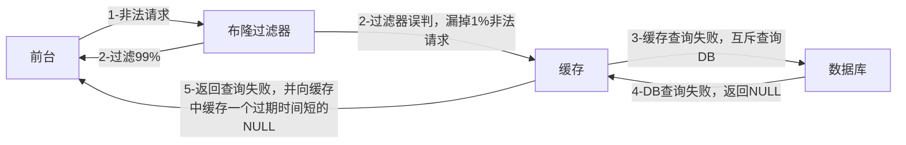

## 单线程VS多线程


## Big Key

### More Key

生产环境下，可能会有大量key，此时若想查找某个key，不能使用`keys *`，它的时间复杂度是O(n),会造成系统严重的卡顿。

诸如`keys`/`flushdb`/`flushall`等危险的命令应该在配置文件中禁用！

```conf
rename- command keys ""
rename- command flushdb ""
rename- command flushall ""
```

---

代替`keys`的查找命令为`scan`，其变体有`hscan`、`zscan`……

SCAN 命令是一个基于游标的迭代器，每次被调用之后， 都会向用户返回一个新的游标， 用户在下次迭代时需要使用这个新游标作为 SCAN 命令的游标参数， 以此来延续之前的迭代过程。

语法：

```shell
SCAN cursor [MATCH pattern] [COUNT count]
```

- cursor: 游标
- pattern: 匹配的模式
- count: 指定从数据集里返回多少元素，默认为 10 

SCAN 返回一个包含两个元素的数组

- 第一个元素是用于进行下一次迭代的新游标， 
- 第二个元素则是一个数组， 这个数组中包含了所有被迭代的元素。如果新游标返回零表示迭代已结束。 

SCAN的遍历顺序

非常特别，它不是从第一维数组的第零位一直遍历到末尾，而是采用了高位进位加法来遍历。之所以使用这样特殊的方式进行遍历，是考虑到字典的扩容和缩容时避免槽位的遍历重复和遗漏。

DEMO案例

```shell
127.0.0.1:6379> keys *
1) "k2"
2) "k1"
3) "k3"
127.0.0.1:6379> SCAN 0 MATCH * COUNT 1
1) "2"
2) 1) "k2"
   2) "k1"
127.0.0.1:6379> SCAN 2 MATCH * COUNT 1
1) "0"
2) 1) "k3"
```

### Big Key

**多大算Big Key**

> 阿里开发规范：
>
> - String控制在 10KB,hash、list、zest、set元素个数不超过5000；
> - 非字符串的bigkey,不能使用del删除，要用hscan、sscan、zscan方式渐进删除，同时防止bigkey过期时间自动删除的问题

**如何发现**

若key小于10KB，则使用–bigkeys

```shell
# 每隔 100 条 scan 指令就会休眠 0.1s，ops 就不会剧烈抬升，但是扫描的时间会变长
redis-cli -h 127.0.0.1 -p 7001 –-bigkeys -i 0.1
```

否则使用memory usage

```shell
MEMORY USAGE key [SAMPLES count]
```

**如何删除**

- String：一般使用`del`,若过大则使用`unlink`

- hash:使用`hscan`每次获取少量的field-value,再使用`hdel`删除每个field

  - HSCAN 命令基本语法:`HSCAN key cursor [MATCH pattern] [COUNT count]`

    - cursor-游标
    - pattern-匹配的模式
    - count-指定从数据集里返回多少元素，默认值为 10

  - ```java
    public void delBigList(String host, int port, String password, String biglistKey) {
        Jedis jedis = new Jedis(host, port);
        if(password != null && !"".equals(password)) {
        	jedis.auth(password);
        }
        long llen = jedis.llen(bigListkey);
        int counter = 0;
        int left = 100;
        while(counter<llen){
            //每次从左侧截每100个
            jedis.ltrim(bigListKey, left, llen);
            counter += left;
            //最终删除key
            jedis.del(bigListkey);
        }
    }
    ```

  - 

- list:使用`ltrim`渐进式逐步删除，知道全部删除完成

  - `LTRIM KEY_NAME START STOP`:删除START——STOP之外的元素

  - ```java
    public void delBiglist(String host, int port, String password, String biglistKey) {
        Jedis jedis = new Jedis(host, port);
        if(password != null && !"".equals(password)) {
            jedis.auth(password);
            long llen = jedis.llen(bigListKey);
        }
        int counter =0;
        int left = 100;
        while(counter<llen) {
            //每次从左侧截每100个
            jedis.ltrim(bigListKey, left, llen);
            counter += left;
        }
        //最终删除key
        jedis.del(bigListKey);
    }
    ```

- set:使用`sscan`每次获取部分元素，再使用`srem`删除每个元素

  - ```java
    public void delBigSet(String host, int port, String password, String bigsetkey){
        Jedis jedis = new Jedis(host, port);
        if(password != null &&!"".equals(password)) {
        	jedis.auth(password);
        }
        ScanParams scanParams =new ScanParams().count(100);
        String cursor = “0”;
        do {
            ScanResult<String>scanResult = jedis.sscan(bigSetKey,cursor, scanParams);
            List<String>memberList=scanResult.getResult();
            if(memberList != null && !memberList.isEmpty()){
            	for(String member :memberList) {
            		jedis.srem(bigSetKey,member);
                }
            }
            cursor =scanResult.getStringCursor();
        } while(!"0".equals(cursor));
            
        //删除bigkey
        jedis.del(bigSetKey);
    }
    ```

- zset:使用`zscan`每次获取部分元素，再使用`zremrangebyrank`删除每个元素

  - ```java
    public void delBigZset(String host, int port, String password, String bigZsetKey) {
        Jedis jedis = new Jedis(host, port);
        if(password != null &&!"".equals(password)){
        	jedis.auth(password);
        }
        ScanParams scanParams =new ScanParams().count(100);
        String cursor =“0”;
        do {
            ScanResult<Tuple>scanResult = jedis.zscan(bigZsetKey, cursor, scanParams);
            List<Tuple>tupleList=scanResult.getResult();
            if(tupleList != null && !tupleList.isEmpty()){
            	for (Tuple tuple :tupleList){
            		jedis.zrem(bigZsetKey,tuple.getElement());
                }
            }
            cursor =scanResult.getStringCursor();
        } while(!"0".equals(cursor));
        //删除bigkey
        jedis.del(bigZsetkey);
    }
    ```

**生产调优**

在Redis配置文件中配置LAZY FREEING

```conf
lazy-free-lazy-server-del yes
replica-lazy-flush yes
lazyfree-lazy-user-del yes
```


## 缓存双写一致性更新策略

详见实战篇

### 先更新数据库后删除缓存

- 尝试使用双检加锁机制lock住MySQL，只让一个请求线程回写Redis，完成数据一致性。
- 当MySQL有记录改动时，若想立刻同步反应到Redis，可以使用Canal 、 Flink CDC这样的框架。
- 可以把要删除的缓存值或是要更新的数据库值暂存到消息队列中，当程序没有成功地删除缓存或更新数据库时，可以从消息队列中重新读取这些值，然后再次进行删除或更新。
- 如果业务层要求必须读取一致性的数据，那就需要在更新数据库时，先在Redis缓存客户端暂停并发读请求，等数据库更新完、缓存值删除后，再读取数据，从而保证数据一致性，这是理论可以达到的效果，但实际不推荐，真实生产环境中，分布式下很难做到实时一致性，一般都是最终一致性。

### 延时双删

- 先删除缓存，预估其它业务的等待时间，休眠对应的时间后再次删除缓存。其它线程读取数据时发现缓存缺失，就会从数据库中读取最新的值了。
- 若想回避延时带来的吞吐量降低，可以将第二次删除改成异步操作。

## HyperLogLog

为什么只占用12KB？

每个 HyperLogLog 实例将输入的哈希值分布到 **16384 个寄存器**（也称为桶或槽）中，每个寄存器存储某个哈希值的 "前导零" 的最大长度。由于 Redis 采用 6 位来存储每个寄存器的最大前导零长度，因此 **16384 个寄存器** 需要：

```txt
16384 (寄存器数) × 6 (每个寄存器占用的位) / 8 (每字节位数) = 12288 字节 = 12 KB
```

---

案例：亿级UV的Redis统计方案

```java
@Service
@Slf4j
public class HyperLogLogService
{
    @Resource
    private RedisTemplate redisTemplate;

    /**
     * 模拟后台有用户点击首页，每个用户来自不同ip地址
     */
    @PostConstruct
    public void init()
    {
        log.info("------模拟后台有用户点击首页，每个用户来自不同ip地址");
        new Thread(() -> {
            String ip = null;
            for (int i = 1; i <=200; i++) {
                Random r = new Random();
                ip = r.nextInt(256) + "." + r.nextInt(256) + "." + r.nextInt(256) + "." + r.nextInt(256);

                Long hll = redisTemplate.opsForHyperLogLog().add("hll", ip);
                log.info("ip={},该ip地址访问首页的次数={}",ip,hll);
                //暂停几秒钟线程
                try { TimeUnit.SECONDS.sleep(3); } catch (InterruptedException e) { e.printStackTrace(); }
            }
        },"t1").start();
    }

}
```

```java
@RestController
@Slf4j
public class HyperLogLogController
{
    @Resource
    private RedisTemplate redisTemplate;

    @GetMapping(value = "/uv")
    public long uv()
    {
        //pfcount
        return redisTemplate.opsForHyperLogLog().size("hll");
    }

}
```

## GEO

案例代码

```java
@Service
@Slf4j
public class GeoService
{
    public static final String CITY ="city";

    @Autowired
    private RedisTemplate redisTemplate;

    public String geoAdd()
    {
        Map<String, Point> map= new HashMap<>();
        map.put("天安门",new Point(116.403963,39.915119));
        map.put("故宫",new Point(116.403414 ,39.924091));
        map.put("长城" ,new Point(116.024067,40.362639));

        redisTemplate.opsForGeo().add(CITY,map);

        return map.toString();
    }

    public Point position(String member) {
        //获取经纬度坐标
        List<Point> list= this.redisTemplate.opsForGeo().position(CITY,member);
        return list.get(0);
    }


    public String hash(String member) {
        //geohash算法生成的base32编码值
        List<String> list= this.redisTemplate.opsForGeo().hash(CITY,member);
        return list.get(0);
    }


    public Distance distance(String member1, String member2) {
        //获取两个给定位置之间的距离
        Distance distance= this.redisTemplate.opsForGeo().distance(CITY,member1,member2, RedisGeoCommands.DistanceUnit.KILOMETERS);
        return distance;
    }

    public GeoResults radiusByxy() {
        //通过经度，纬度查找附近的,北京王府井位置116.418017,39.914402
        Circle circle = new Circle(116.418017, 39.914402, Metrics.KILOMETERS.getMultiplier());
        //返回50条
        RedisGeoCommands.GeoRadiusCommandArgs args = RedisGeoCommands.GeoRadiusCommandArgs.newGeoRadiusArgs().includeDistance().includeCoordinates().sortAscending().limit(50);
        GeoResults<RedisGeoCommands.GeoLocation<String>> geoResults= this.redisTemplate.opsForGeo().radius(CITY,circle, args);
        return geoResults;
    }

    public GeoResults radiusByMember() {
        //通过地方查找附近
        String member="天安门";
        //返回50条
        RedisGeoCommands.GeoRadiusCommandArgs args = RedisGeoCommands.GeoRadiusCommandArgs.newGeoRadiusArgs().includeDistance().includeCoordinates().sortAscending().limit(50);
        //半径10公里内
        Distance distance=new Distance(10, Metrics.KILOMETERS);
        GeoResults<RedisGeoCommands.GeoLocation<String>> geoResults= this.redisTemplate.opsForGeo().radius(CITY,member, distance,args);
        return geoResults;
    }
}
```

```java
@Api(tags = "美团地图位置附近的酒店推送GEO")
@RestController
@Slf4j
public class GeoController
{
    @Resource
    private GeoService geoService;

    @ApiOperation("添加坐标geoadd")
    @RequestMapping(value = "/geoadd",method = RequestMethod.GET)
    public String geoAdd()
    {
        return geoService.geoAdd();
    }

    @ApiOperation("获取经纬度坐标geopos")
    @RequestMapping(value = "/geopos",method = RequestMethod.GET)
    public Point position(String member)
    {
        return geoService.position(member);
    }

    @ApiOperation("获取经纬度生成的base32编码值geohash")
    @RequestMapping(value = "/geohash",method = RequestMethod.GET)
    public String hash(String member)
    {
        return geoService.hash(member);
    }

    @ApiOperation("获取两个给定位置之间的距离")
    @RequestMapping(value = "/geodist",method = RequestMethod.GET)
    public Distance distance(String member1, String member2)
    {
        return geoService.distance(member1,member2);
    }

    @ApiOperation("通过经度纬度查找北京王府井附近的")
    @RequestMapping(value = "/georadius",method = RequestMethod.GET)
    public GeoResults radiusByxy()
    {
        return geoService.radiusByxy();
    }

    @ApiOperation("通过地方查找附近,本例写死天安门作为地址")
    @RequestMapping(value = "/georadiusByMember",method = RequestMethod.GET)
    public GeoResults radiusByMember()
    {
        return geoService.radiusByMember();
    }

}
```

## 布隆过滤器

布隆过滤器(Bloom Filter) 是一种专门用来解决去重问题的高级数据结构。

实质就是一个大型位数组和几个不同的无偏hash函数(无偏表示分布均匀)。由一个初值都为零的bit数组和多个哈希函数构成，用来快速判断某个数据是否存在。但是跟 HyperLogLog 一样，它也一样有那么一点点不精确，也存在一定的误判概率

**特点**

- 不能删除元素：标准布隆过滤器不支持删除操作，因为删除操作可能会影响其他元素的查询结果。
- 判定元素是否存在时：存在代表大概率存在；不存在代表一定不存在。

**原理**

- 添加key时：使用多个hash函数对key进行hash运算得到一个整数索引值，对位数组长度进行取模运算得到一个位置，每个hash函数都会得到一个不同的位置，将这几个位置都置1就完成了add操作。
- 查询key时：只要有其中一位是零就表示这个key不存在，但如果都是1，则不一定存在对应的key。

**案例**

```java
@Component
@Slf4j
public class BloomFilterInit
{
    @Resource
    private RedisTemplate redisTemplate;

    @PostConstruct//初始化白名单数据，故意差异化数据演示效果......
    public void init()
    {
        //白名单客户预加载到布隆过滤器
        String uid = "customer:12";
        //1 计算hashcode，由于可能有负数，直接取绝对值
        int hashValue = Math.abs(uid.hashCode());
        //2 通过hashValue和2的32次方取余后，获得对应的下标坑位
        long index = (long) (hashValue % Math.pow(2, 32));
        log.info(uid+" 对应------坑位index:{}",index);
        //3 设置redis里面bitmap对应坑位，该有值设置为1
        redisTemplate.opsForValue().setBit("whitelistCustomer",index,true);
    }
}
```

```java
@Component
@Slf4j
public class CheckUtils
{
    @Resource
    private RedisTemplate redisTemplate;

    public boolean checkWithBloomFilter(String checkItem,String key)
    {
        int hashValue = Math.abs(key.hashCode());
        long index = (long) (hashValue % Math.pow(2, 32));
        boolean existOK = redisTemplate.opsForValue().getBit(checkItem, index);
        log.info("----->key:"+key+"\t对应坑位index:"+index+"\t是否存在:"+existOK);
        return existOK;
    }
}
```

```java
@Service
@Slf4j
public class CustomerSerivce
{
    public static final String CACHE_KEY_CUSTOMER = "customer:";

    @Resource
    private CustomerMapper customerMapper;
    @Resource
    private RedisTemplate redisTemplate;

    @Resource
    private CheckUtils checkUtils;

    public void addCustomer(Customer customer){
        int i = customerMapper.insertSelective(customer);

        if(i > 0)
        {
            //到数据库里面，重新捞出新数据出来，做缓存
            customer=customerMapper.selectByPrimaryKey(customer.getId());
            //缓存key
            String key=CACHE_KEY_CUSTOMER+customer.getId();
            //往mysql里面插入成功随后再从mysql查询出来，再插入redis
            redisTemplate.opsForValue().set(key,customer);
        }
    }

    public Customer findCustomerById(Integer customerId){
        Customer customer = null;

        //缓存key的名称
        String key=CACHE_KEY_CUSTOMER+customerId;

        //1 查询redis
        customer = (Customer) redisTemplate.opsForValue().get(key);

        //redis无，进一步查询mysql
        if(customer==null)
        {
            //2 从mysql查出来customer
            customer=customerMapper.selectByPrimaryKey(customerId);
            // mysql有，redis无
            if (customer != null) {
                //3 把mysql捞到的数据写入redis，方便下次查询能redis命中。
                redisTemplate.opsForValue().set(key,customer);
            }
        }
        return customer;
    }

    /**
     * BloomFilter → redis → mysql
     * 白名单：whitelistCustomer
     * @param customerId
     * @return
     */

    @Resource
    private CheckUtils checkUtils;
    public Customer findCustomerByIdWithBloomFilter (Integer customerId)
    {
        Customer customer = null;

        //缓存key的名称
        String key = CACHE_KEY_CUSTOMER + customerId;

        //布隆过滤器check，无是绝对无，有是可能有
        //===============================================
        if(!checkUtils.checkWithBloomFilter("whitelistCustomer",key))
        {
            log.info("白名单无此顾客信息:{}",key);
            return null;
        }
        //===============================================

        //1 查询redis
        customer = (Customer) redisTemplate.opsForValue().get(key);
        //redis无，进一步查询mysql
        if (customer == null) {
            //2 从mysql查出来customer
            customer = customerMapper.selectByPrimaryKey(customerId);
            // mysql有，redis无
            if (customer != null) {
                //3 把mysql捞到的数据写入redis，方便下次查询能redis命中。
                redisTemplate.opsForValue().set(key, customer);
            }
        }
        return customer;
    }
}
```

```java
@Api(tags = "客户Customer接口+布隆过滤器讲解")
@RestController
@Slf4j
public class CustomerController
{
    @Resource private CustomerSerivce customerSerivce;

    @ApiOperation("数据库初始化2条Customer数据")
    @RequestMapping(value = "/customer/add", method = RequestMethod.POST)
    public void addCustomer() {
        for (int i = 0; i < 2; i++) {
            Customer customer = new Customer();

            customer.setCname("customer"+i);
            customer.setAge(new Random().nextInt(30)+1);
            customer.setPhone("1381111xxxx");
            customer.setSex((byte) new Random().nextInt(2));
            customer.setBirth(Date.from(LocalDateTime.now().atZone(ZoneId.systemDefault()).toInstant()));

            customerSerivce.addCustomer(customer);
        }
    }

    @ApiOperation("单个用户查询，按customerid查用户信息")
    @RequestMapping(value = "/customer/{id}", method = RequestMethod.GET)
    public Customer findCustomerById(@PathVariable int id) {
        return customerSerivce.findCustomerById(id);
    }

    @ApiOperation("BloomFilter案例讲解")
    @RequestMapping(value = "/customerbloomfilter/{id}", method = RequestMethod.GET)
    public Customer findCustomerByIdWithBloomFilter(@PathVariable int id) throws ExecutionException, InterruptedException
    {
        return customerSerivce.findCustomerByIdWithBloomFilter(id);
    }
}
```

**布谷鸟过滤器**

能够解决布隆过滤器不能删除元素的问题，但成熟度和使用率不如布隆过滤器

## 缓存预热、穿透、击穿、雪崩

### 缓存预热

对于热点key，事先在`@postconstrct`中初始化白名单数据

### 缓存雪崩

缓存雪崩是指在分布式系统中，当大量缓存同时过期或失效，导致大量请求直接访问后端数据库，从而引发数据库负载骤增，可能造成系统崩溃的现象。

**预防/解决**

1. 将key设置为永不过期、随机的过期时间
2. 缓存集群实现高可用
   - 主从+哨兵
   - Redis Cluster
   - 开启AOF、RDB，尽快恢复缓存集群
3. 双重缓存
   - ehcache本地缓存
   - Redis缓存
4. 服务限流、降级
   - Hystrix
   - Sentinel
5. 购买Redis云数据库

### 缓存穿透

查询的数据不存在于Redis，也不存在于MySQL，频繁的此类查询会导致数据库压力过大而宕机。

**解决方案1：缓存空对象**

详见实战篇

**解决方案2：Google的布隆过滤器Guava**




### 缓存击穿


