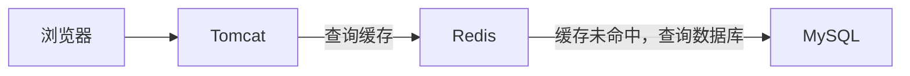
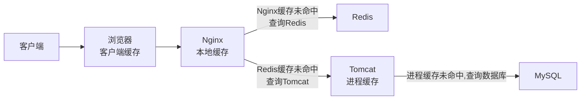
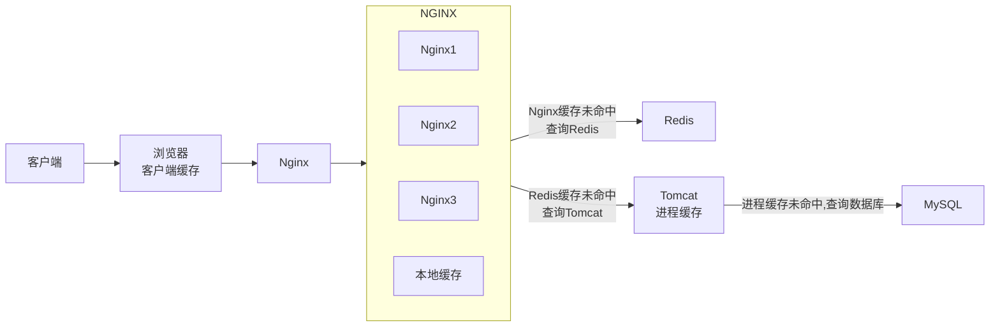
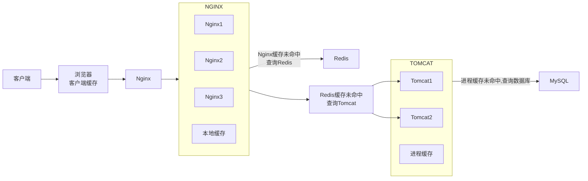
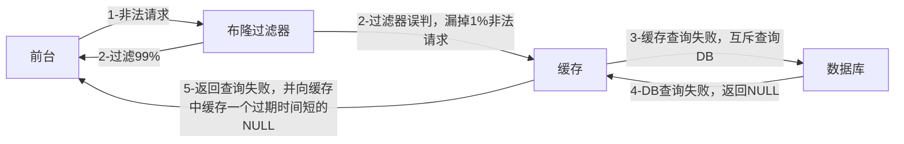
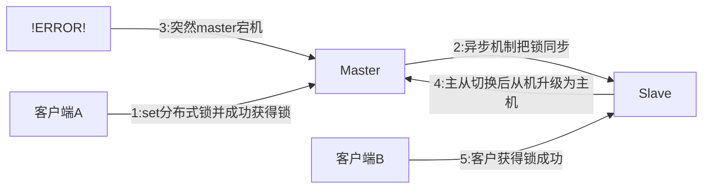

## 单线程VS多线程


## 大Key

### More Key

生产环境下，可能会有大量key，此时若想查找某个key，不能使用`keys *`，它的时间复杂度是O(n),会造成系统严重的卡顿。

诸如`keys`/`flushdb`/`flushall`等危险的命令应该在配置文件中禁用！

```conf
rename- command keys ""
rename- command flushdb ""
rename- command flushall ""
```

---

代替`keys`的查找命令为`scan`，其变体有`hscan`、`zscan`……

SCAN 命令是一个基于游标的迭代器，每次被调用之后， 都会向用户返回一个新的游标， 用户在下次迭代时需要使用这个新游标作为 SCAN 命令的游标参数， 以此来延续之前的迭代过程。

语法：

```shell
SCAN cursor [MATCH pattern] [COUNT count]
```

- cursor: 游标
- pattern: 匹配的模式
- count: 指定从数据集里返回多少元素，默认为 10 

SCAN 返回一个包含两个元素的数组

- 第一个元素是用于进行下一次迭代的新游标， 
- 第二个元素则是一个数组， 这个数组中包含了所有被迭代的元素。如果新游标返回零表示迭代已结束。 

SCAN的遍历顺序

非常特别，它不是从第一维数组的第零位一直遍历到末尾，而是采用了高位进位加法来遍历。之所以使用这样特殊的方式进行遍历，是考虑到字典的扩容和缩容时避免槽位的遍历重复和遗漏。

DEMO案例

```shell
127.0.0.1:6379> keys *
1) "k2"
2) "k1"
3) "k3"
127.0.0.1:6379> SCAN 0 MATCH * COUNT 1
1) "2"
2) 1) "k2"
   2) "k1"
127.0.0.1:6379> SCAN 2 MATCH * COUNT 1
1) "0"
2) 1) "k3"
```

### Big Key

**Big Key 判定规则**

- Key本身的数据量过大：一个String类型的Key，它的值为 5 MB
- Key中的成员数过多：一个ZSET类型的Key，它的成员数量为10,000个
- Key中成员的数据量过大：一个Hash类型的Key，它的成员数量虽然只有1,000个但这些成员的Value（值）总大小为100 MB

> 阿里开发规范：
>
> - String控制在 10KB,hash、list、zest、set元素个数不超过5000；
> - 非字符串的bigkey,不能使用del删除，要用hscan、sscan、zscan方式渐进删除，同时防止bigkey过期时间自动删除的问题

**Big Key的危害**

- 网络阻塞
  - 对BigKey执行读请求时，少量的QPS就可能导致带宽使用率被占满，导致Redis实例，乃至所在物理机变慢
- 数据倾斜
  - BigKey所在的Redis实例内存使用率远超其他实例，无法使数据分片的内存资源达到均衡
- Redis阻塞
  - 对元素较多的hash、list、zset等做运算会耗时较久，使主线程被阻塞
- CPU压力
  - 对BigKey的数据序列化和反序列化会导致CPU的使用率飙升，影响Redis实例和本机其它应用

**如何发现**

1. key小于10KB，则使用–bigkeys

```shell
# 每隔 100 条 scan 指令就会休眠 0.1s，ops 就不会剧烈抬升，但是扫描的时间会变长
redis-cli -h 127.0.0.1 -p 7001 –-bigkeys -i 0.1
```

2. 使用memory usage （此指令CPU占用率高，利用strlen、hlen等命令判断key的长度即可）

```shell
MEMORY USAGE key [SAMPLES count]
```

3. 利用第三方工具，如 Redis-Rdb-Tools 分析RDB快照文件，全面分析内存使用情况

   https://github.com/sripathikrishnan/redis-rdb-tools

4. 网络监控
   - 自定义工具，监控进出Redis的网络数据，超出预警值时主动告警
   - 一般阿里云搭建的云服务器就有相关监控页面

**如何删除**

- String：一般使用`del`,若过大则使用异步删除命令`unlink`

- hash:使用`hscan`每次获取少量的field-value,再使用`hdel`删除每个field

  - HSCAN 命令基本语法:`HSCAN key cursor [MATCH pattern] [COUNT count]`

    - cursor-游标
    - pattern-匹配的模式
    - count-指定从数据集里返回多少元素，默认值为 10

  - ```java
    public void delBigList(String host, int port, String password, String biglistKey) {
        Jedis jedis = new Jedis(host, port);
        if(password != null && !"".equals(password)) {
        	jedis.auth(password);
        }
        long llen = jedis.llen(bigListkey);
        int counter = 0;
        int left = 100;
        while(counter<llen){
            //每次从左侧截每100个
            jedis.ltrim(bigListKey, left, llen);
            counter += left;
            //最终删除key
            jedis.del(bigListkey);
        }
    }
    ```

  - 

- list:使用`ltrim`渐进式逐步删除，知道全部删除完成

  - `LTRIM KEY_NAME START STOP`:删除START——STOP之外的元素

  - ```java
    public void delBiglist(String host, int port, String password, String biglistKey) {
        Jedis jedis = new Jedis(host, port);
        if(password != null && !"".equals(password)) {
            jedis.auth(password);
            long llen = jedis.llen(bigListKey);
        }
        int counter =0;
        int left = 100;
        while(counter<llen) {
            //每次从左侧截每100个
            jedis.ltrim(bigListKey, left, llen);
            counter += left;
        }
        //最终删除key
        jedis.del(bigListKey);
    }
    ```

- set:使用`sscan`每次获取部分元素，再使用`srem`删除每个元素

  - ```java
    public void delBigSet(String host, int port, String password, String bigsetkey){
        Jedis jedis = new Jedis(host, port);
        if(password != null &&!"".equals(password)) {
        	jedis.auth(password);
        }
        ScanParams scanParams =new ScanParams().count(100);
        String cursor = “0”;
        do {
            ScanResult<String>scanResult = jedis.sscan(bigSetKey,cursor, scanParams);
            List<String>memberList=scanResult.getResult();
            if(memberList != null && !memberList.isEmpty()){
            	for(String member :memberList) {
            		jedis.srem(bigSetKey,member);
                }
            }
            cursor =scanResult.getStringCursor();
        } while(!"0".equals(cursor));
            
        //删除bigkey
        jedis.del(bigSetKey);
    }
    ```

- zset:使用`zscan`每次获取部分元素，再使用`zremrangebyrank`删除每个元素

  - ```java
    public void delBigZset(String host, int port, String password, String bigZsetKey) {
        Jedis jedis = new Jedis(host, port);
        if(password != null &&!"".equals(password)){
        	jedis.auth(password);
        }
        ScanParams scanParams =new ScanParams().count(100);
        String cursor =“0”;
        do {
            ScanResult<Tuple>scanResult = jedis.zscan(bigZsetKey, cursor, scanParams);
            List<Tuple>tupleList=scanResult.getResult();
            if(tupleList != null && !tupleList.isEmpty()){
            	for (Tuple tuple :tupleList){
            		jedis.zrem(bigZsetKey,tuple.getElement());
                }
            }
            cursor =scanResult.getStringCursor();
        } while(!"0".equals(cursor));
        //删除bigkey
        jedis.del(bigZsetkey);
    }
    ```

**生产调优**

在Redis配置文件中配置LAZY FREEING

```conf
lazy-free-lazy-server-del yes
replica-lazy-flush yes
lazyfree-lazy-user-del yes
```

### 恰当的Key设计

Redis的Key虽然可以自定义，但最好遵循下面的几个最佳实践约定：

- 遵循基本格式：[业务名称]:[数据名]:[id]
- 长度不超过44字节
- 不包含特殊字符

例如：我们的登录业务，保存用户信息，其key可以设计成如下格式：

`login:user:10`

- login:业务名称
- user:数据名称
- 10:数据ID

这样设计的好处：

- 可读性强
- 避免key冲突
- 方便管理
- 更节省内存： key是string类型，底层编码包含int、embstr和raw三种。embstr在小于44字节使用，采用连续内存空间，内存占用更小。当字节数大于44字节时，会转为raw模式存储，在raw模式下，内存空间不是连续的，而是采用一个指针指向了另外一段内存空间，在这段空间里存储SDS内容，这样空间不连续，访问的时候性能也就会收到影响，还有可能产生内存碎片

## 批处理优化

### 客户端与Redis的交互流程


Redis处理指令是很快的，主要花费的时候在于网络传输。于是乎很容易想到将多条指令批量的传输给redis


### MSet

Redis提供了很多Mxxx这样的命令，可以实现批量插入数据，例如：

- mset
- hmset

利用mset批量插入10万条数据

```java
@Test
void testMxx() {
    String[] arr = new String[2000];
    int j;
    long b = System.currentTimeMillis();
    for (int i = 1; i <= 100000; i++) {
        j = (i % 1000) << 1;
        arr[j] = "test:key_" + i;
        arr[j + 1] = "value_" + i;
        if (j == 0) {
            jedis.mset(arr);
        }
    }
    long e = System.currentTimeMillis();
    System.out.println("time: " + (e - b));
}
```

### Pipeline

MSET虽然可以批处理，但是却只能操作部分数据类型，因此如果有对复杂数据类型的批处理需要，建议使用Pipeline

```java
@Test
void testPipeline() {
    // 创建管道
    Pipeline pipeline = jedis.pipelined();
    long b = System.currentTimeMillis();
    for (int i = 1; i <= 100000; i++) {
        // 放入命令到管道
        pipeline.set("test:key_" + i, "value_" + i);
        if (i % 1000 == 0) {
            // 每放入1000条命令，批量执行
            pipeline.sync();
        }
    }
    long e = System.currentTimeMillis();
    System.out.println("time: " + (e - b));
}
```

### 集群下的批处理

如MSET或Pipeline这样的批处理需要在一次请求中携带多条命令，而此时如果Redis是一个集群，那批处理命令的多个key必须落在一个插槽中，否则就会导致执行失败。大家可以想一想这样的要求其实很难实现，因为我们在批处理时，可能一次要插入很多条数据，这些数据很有可能不会都落在相同的节点上，这就会导致报错了

有4种解决方案


- 第一种方案：串行执行，所以这种方式没有什么意义，当然，执行起来就很简单了，缺点就是耗时过久。

- 第二种方案：串行slot，简单来说，就是执行前，客户端先计算一下对应的key的slot，一样slot的key就放到一个组里边，不同的，就放到不同的组里边，然后对每个组执行pipeline的批处理，他就能串行执行各个组的命令，这种做法比第一种方法耗时要少，但是缺点呢，相对来说复杂一点，所以这种方案还需要优化一下

- 第三种方案：并行slot，相较于第二种方案，在分组完成后串行执行，第三种方案，就变成了并行执行各个命令，所以他的耗时就非常短，但是实现呢，也更加复杂。

- 第四种：hash_tag，redis计算key的slot的时候，其实是根据key的有效部分来计算的，通过这种方式就能一次处理所有的key，这种方式耗时最短，实现也简单，但是如果通过操作key的有效部分，那么就会导致所有的key都落在一个节点上，产生数据倾斜的问题，所以**推荐使用第三种方式**。

## 慢查询优化

**定义：**在Redis执行时耗时超过某个阈值的命令，称为慢查询。

**危害：**由于Redis是单线程的，所以当客户端发出指令后，他们都会进入到redis底层的queue来执行，如果此时有一些慢查询的数据，就会导致大量请求阻塞，从而引起报错，所以我们需要解决慢查询问题。

慢查询的阈值可以通过配置指定：

- slowlog-log-slower-than：慢查询阈值，单位是微秒。默认是10000，建议1000。

慢查询会被放入慢查询日志中，日志的长度有上限，可以通过配置指定：

- slowlog-max-len：慢查询日志（本质是一个队列）的长度。默认是128，建议1000。

修改这两个配置可以使用 `config set`命令。

**查看慢查询**

- `slowlog len`：查询慢查询日志长度
- `slowlog get [n]`：读取n条慢查询日志
- `slowlog reset`：清空慢查询列表


## 内存划分、配置

当Redis内存不足时，可能导致Key频繁被删除、响应时间变长、QPS不稳定等问题。当内存使用率达到90%以上时就需要我们警惕，并快速定位到内存占用的原因。

**碎片问题分析**

Redis底层分配并不是这个key有多大，他就会分配多大，而是有他自己的分配策略，比如8,16,20等等，假定当前key只需要10个字节，此时分配8肯定不够，那么他就会分配16个字节，多出来的6个字节就不能被使用，这就是我们常说的 碎片问题

**进程内存问题分析**

这片内存，通常都可以忽略不计

**缓冲区内存问题分析**

一般包括客户端缓冲区、AOF缓冲区、复制缓冲区等。客户端缓冲区又包括输入缓冲区和输出缓冲区两种。这部分内存占用波动较大，所以这片内存也是我们需要重点分析的内存问题。

| **内存占用** |                           **说明**                           |
| :----------: | :----------------------------------------------------------: |
|   数据内存   | 是Redis最主要的部分，存储Redis的键值信息。主要问题是BigKey问题、内存碎片问题 |
|   进程内存   | Redis主进程本身运⾏肯定需要占⽤内存，如代码、常量池等等；这部分内存⼤约⼏兆，在⼤多数⽣产环境中与Redis数据占⽤的内存相⽐可以忽略。 |
|  缓冲区内存  | 一般包括客户端缓冲区、AOF缓冲区、复制缓冲区等。客户端缓冲区又包括输入缓冲区和输出缓冲区两种。这部分内存占用波动较大，不当使用BigKey，可能导致内存溢出。 |

于是我们就需要通过一些命令，可以查看到Redis目前的内存分配状态：

* `info memory`：查看内存分配的情况
* `memory xxx`：查看key的主要占用情况

看到了这些配置，最关键的缓存区内存如何定位和解决呢？

内存缓冲区常见的有三种：

* 复制缓冲区：主从复制的repl_backlog_buf，如果太小可能导致频繁的全量复制，影响性能。通过replbacklog-size来设置，默认1MB
* AOF缓冲区：AOF刷盘之前的缓存区域，AOF执行rewrite的缓冲区。无法设置容量上限
* 客户端缓冲区：分为输入缓冲区和输出缓冲区，输入缓冲区最大1G且不能设置。输出缓冲区可以设置

复制缓冲区和AOF缓冲区不会有问题，最关键就是客户端缓冲区的问题

客户端缓冲区：指的就是我们发送命令时，客户端用来缓存命令的一个缓冲区，也就是我们向redis输入数据的输入端缓冲区和redis向客户端返回数据的响应缓存区，输入缓冲区最大1G且不能设置，所以这一块根本不用担心，如果超过了这个空间，redis会直接断开，因为本来此时此刻就代表着redis处理不过来了，我们需要担心的就是输出端缓冲区


在使用redis过程中，处理大量的big value，会导致输出结果过多，如果输出缓存区过大，会导致redis直接断开，而默认配置的情况下是没有大小的，内存可能一下子被占满，会直接导致redis断开，解决方案有两个

1、设置一个大小

2、增加我们带宽的大小，避免我们出现大量数据从而直接超过了redis的承受能力

## 多级缓存

传统的缓存策略一般是请求到达Tomcat后，先查询Redis，如果未命中则查询数据库



存在下面的问题：

- 请求要经过Tomcat处理，Tomcat的性能成为整个系统的瓶颈

- Redis缓存失效时，会对数据库产生冲击

多级缓存就是充分利用请求处理的每个环节，分别添加缓存，减轻Tomcat压力，提升服务性能：

- 浏览器访问静态资源时，优先读取浏览器本地缓存
- 访问非静态资源（ajax查询数据）时，访问服务端
- 请求到达Nginx后，优先读取Nginx本地缓存
- 如果Nginx本地缓存未命中，则去直接查询Redis（不经过Tomcat）
- 如果Redis查询未命中，则查询Tomcat
- 请求进入Tomcat后，优先查询JVM进程缓存
- 如果JVM进程缓存未命中，则查询数据库



在多级缓存架构中，Nginx内部需要编写本地缓存查询、Redis查询、Tomcat查询的业务逻辑，因此这样的nginx服务不再是一个**反向代理服务器**，而是一个编写**业务的Web服务器了**。

因此这样的业务Nginx服务也需要搭建集群来提高并发，再有专门的nginx服务来做反向代理，如图：



另外，我们的Tomcat服务将来也会部署为集群模式：



可见，多级缓存的关键有两个：

- 一个是在nginx中编写业务，实现nginx本地缓存、Redis、Tomcat的查询
  - OpenResty框架结合Lua语言

- 另一个就是在Tomcat中实现JVM进程缓存
  - Caffeine


## 缓存双写一致性更新策略

### 同步策略

缓存数据同步的常见方式有三种：

**设置有效期**：给缓存设置有效期，到期后自动删除。再次查询时更新

- 优势：简单、方便
- 缺点：时效性差，缓存过期之前可能不一致
- 场景：更新频率较低，时效性要求低的业务

**同步双写**：在修改数据库的同时，直接修改缓存

- 优势：时效性强，缓存与数据库强一致
- 缺点：有代码侵入，耦合度高；
- 场景：对一致性、时效性要求较高的缓存数据

**异步通知：**修改数据库时发送事件通知，相关服务监听到通知后修改缓存数据

- 优势：低耦合，可以同时通知多个缓存服务
- 缺点：时效性一般，可能存在中间不一致状态
- 场景：时效性要求一般，有多个服务需要同步

### 同步双写更新策略

**先更新数据库后删除缓存**

- 尝试使用双检加锁机制lock住MySQL，只让一个请求线程回写Redis，完成数据一致性。
- 当MySQL有记录改动时，若想立刻同步反应到Redis，可以使用Canal 、 Flink CDC这样的框架。
- 可以把要删除的缓存值或是要更新的数据库值暂存到消息队列中，当程序没有成功地删除缓存或更新数据库时，可以从消息队列中重新读取这些值，然后再次进行删除或更新。
- 如果业务层要求必须读取一致性的数据，那就需要在更新数据库时，先在Redis缓存客户端暂停并发读请求，等数据库更新完、缓存值删除后，再读取数据，从而保证数据一致性，这是理论可以达到的效果，但实际不推荐，真实生产环境中，分布式下很难做到实时一致性，一般都是最终一致性。

**延时双删**

- 先删除缓存，预估其它业务的等待时间，休眠对应的时间后再次删除缓存。其它线程读取数据时发现缓存缺失，就会从数据库中读取最新的值了。
- 若想回避延时带来的吞吐量降低，可以将第二次删除改成异步操作。

### 异步通知更新策略

1. 消息队列

   ```mermaid
   flowchart LR
   客户端 -->|修改商品| item-service -->|1.1写入数据库| MySQL
   item-service -->|1.2发布消息| MQ -->|2.1监听消息| cache-service -->|2.2更新缓存| Redis
   ```

   - 商品服务完成对数据的修改后，只需要发送一条消息到MQ中。
   - 缓存服务监听MQ消息，然后完成对缓存的更新

   有少量的代码侵入

2. Canal

   ```mermaid
   flowchart LR
   客户端 -->|修改商品| item-service -->|1.写入数据库| MySQL --> Canal\n2.1监听MySQL的binlog --> |2.2通知数据变更情况| cache-service -->|2.3更新缓存| Redis
   ```

   - 商品服务完成商品修改后，业务直接结束，没有任何代码侵入
   - Canal监听MySQL变化，当发现变化后，立即通知缓存服务
   - 缓存服务接收到canal通知，更新缓存

   代码零侵入

3. Flink CDC

## HyperLogLog

为什么只占用12KB？

每个 HyperLogLog 实例将输入的哈希值分布到 **16384 个寄存器**（也称为桶或槽）中，每个寄存器存储某个哈希值的 "前导零" 的最大长度。由于 Redis 采用 6 位来存储每个寄存器的最大前导零长度，因此 **16384 个寄存器** 需要：

```txt
16384 (寄存器数) × 6 (每个寄存器占用的位) / 8 (每字节位数) = 12288 字节 = 12 KB
```

---

案例：亿级UV的Redis统计方案

```java
@Service
@Slf4j
public class HyperLogLogService
{
    @Resource
    private RedisTemplate redisTemplate;

    /**
     * 模拟后台有用户点击首页，每个用户来自不同ip地址
     */
    @PostConstruct
    public void init()
    {
        log.info("------模拟后台有用户点击首页，每个用户来自不同ip地址");
        new Thread(() -> {
            String ip = null;
            for (int i = 1; i <=200; i++) {
                Random r = new Random();
                ip = r.nextInt(256) + "." + r.nextInt(256) + "." + r.nextInt(256) + "." + r.nextInt(256);

                Long hll = redisTemplate.opsForHyperLogLog().add("hll", ip);
                log.info("ip={},该ip地址访问首页的次数={}",ip,hll);
                //暂停几秒钟线程
                try { TimeUnit.SECONDS.sleep(3); } catch (InterruptedException e) { e.printStackTrace(); }
            }
        },"t1").start();
    }

}
```

```java
@RestController
@Slf4j
public class HyperLogLogController
{
    @Resource
    private RedisTemplate redisTemplate;

    @GetMapping(value = "/uv")
    public long uv()
    {
        //pfcount
        return redisTemplate.opsForHyperLogLog().size("hll");
    }

}
```

## GEO

案例代码

```java
@Service
@Slf4j
public class GeoService
{
    public static final String CITY ="city";

    @Autowired
    private RedisTemplate redisTemplate;

    public String geoAdd()
    {
        Map<String, Point> map= new HashMap<>();
        map.put("天安门",new Point(116.403963,39.915119));
        map.put("故宫",new Point(116.403414 ,39.924091));
        map.put("长城" ,new Point(116.024067,40.362639));

        redisTemplate.opsForGeo().add(CITY,map);

        return map.toString();
    }

    public Point position(String member) {
        //获取经纬度坐标
        List<Point> list= this.redisTemplate.opsForGeo().position(CITY,member);
        return list.get(0);
    }


    public String hash(String member) {
        //geohash算法生成的base32编码值
        List<String> list= this.redisTemplate.opsForGeo().hash(CITY,member);
        return list.get(0);
    }


    public Distance distance(String member1, String member2) {
        //获取两个给定位置之间的距离
        Distance distance= this.redisTemplate.opsForGeo().distance(CITY,member1,member2, RedisGeoCommands.DistanceUnit.KILOMETERS);
        return distance;
    }

    public GeoResults radiusByxy() {
        //通过经度，纬度查找附近的,北京王府井位置116.418017,39.914402
        Circle circle = new Circle(116.418017, 39.914402, Metrics.KILOMETERS.getMultiplier());
        //返回50条
        RedisGeoCommands.GeoRadiusCommandArgs args = RedisGeoCommands.GeoRadiusCommandArgs.newGeoRadiusArgs().includeDistance().includeCoordinates().sortAscending().limit(50);
        GeoResults<RedisGeoCommands.GeoLocation<String>> geoResults= this.redisTemplate.opsForGeo().radius(CITY,circle, args);
        return geoResults;
    }

    public GeoResults radiusByMember() {
        //通过地方查找附近
        String member="天安门";
        //返回50条
        RedisGeoCommands.GeoRadiusCommandArgs args = RedisGeoCommands.GeoRadiusCommandArgs.newGeoRadiusArgs().includeDistance().includeCoordinates().sortAscending().limit(50);
        //半径10公里内
        Distance distance=new Distance(10, Metrics.KILOMETERS);
        GeoResults<RedisGeoCommands.GeoLocation<String>> geoResults= this.redisTemplate.opsForGeo().radius(CITY,member, distance,args);
        return geoResults;
    }
}
```

```java
@Api(tags = "美团地图位置附近的酒店推送GEO")
@RestController
@Slf4j
public class GeoController
{
    @Resource
    private GeoService geoService;

    @ApiOperation("添加坐标geoadd")
    @RequestMapping(value = "/geoadd",method = RequestMethod.GET)
    public String geoAdd()
    {
        return geoService.geoAdd();
    }

    @ApiOperation("获取经纬度坐标geopos")
    @RequestMapping(value = "/geopos",method = RequestMethod.GET)
    public Point position(String member)
    {
        return geoService.position(member);
    }

    @ApiOperation("获取经纬度生成的base32编码值geohash")
    @RequestMapping(value = "/geohash",method = RequestMethod.GET)
    public String hash(String member)
    {
        return geoService.hash(member);
    }

    @ApiOperation("获取两个给定位置之间的距离")
    @RequestMapping(value = "/geodist",method = RequestMethod.GET)
    public Distance distance(String member1, String member2)
    {
        return geoService.distance(member1,member2);
    }

    @ApiOperation("通过经度纬度查找北京王府井附近的")
    @RequestMapping(value = "/georadius",method = RequestMethod.GET)
    public GeoResults radiusByxy()
    {
        return geoService.radiusByxy();
    }

    @ApiOperation("通过地方查找附近,本例写死天安门作为地址")
    @RequestMapping(value = "/georadiusByMember",method = RequestMethod.GET)
    public GeoResults radiusByMember()
    {
        return geoService.radiusByMember();
    }

}
```

## 布隆过滤器

布隆过滤器(Bloom Filter) 是一种专门用来解决去重问题的高级数据结构。

实质就是一个大型位数组和几个不同的无偏hash函数(无偏表示分布均匀)。由一个初值都为零的bit数组和多个哈希函数构成，用来快速判断某个数据是否存在。但是跟 HyperLogLog 一样，它也一样有那么一点点不精确，也存在一定的误判概率

**特点**

- 不能删除元素：标准布隆过滤器不支持删除操作，因为删除操作可能会影响其他元素的查询结果。
- 判定元素是否存在时：存在代表大概率存在；不存在代表一定不存在。

**原理**

- 添加key时：使用多个hash函数对key进行hash运算得到一个整数索引值，对位数组长度进行取模运算得到一个位置，每个hash函数都会得到一个不同的位置，将这几个位置都置1就完成了add操作。
- 查询key时：只要有其中一位是零就表示这个key不存在，但如果都是1，则不一定存在对应的key。

**案例**

```java
@Component
@Slf4j
public class BloomFilterInit
{
    @Resource
    private RedisTemplate redisTemplate;

    @PostConstruct//初始化白名单数据，故意差异化数据演示效果......
    public void init()
    {
        //白名单客户预加载到布隆过滤器
        String uid = "customer:12";
        //1 计算hashcode，由于可能有负数，直接取绝对值
        int hashValue = Math.abs(uid.hashCode());
        //2 通过hashValue和2的32次方取余后，获得对应的下标坑位
        long index = (long) (hashValue % Math.pow(2, 32));
        log.info(uid+" 对应------坑位index:{}",index);
        //3 设置redis里面bitmap对应坑位，该有值设置为1
        redisTemplate.opsForValue().setBit("whitelistCustomer",index,true);
    }
}
```

```java
@Component
@Slf4j
public class CheckUtils
{
    @Resource
    private RedisTemplate redisTemplate;

    public boolean checkWithBloomFilter(String checkItem,String key)
    {
        int hashValue = Math.abs(key.hashCode());
        long index = (long) (hashValue % Math.pow(2, 32));
        boolean existOK = redisTemplate.opsForValue().getBit(checkItem, index);
        log.info("----->key:"+key+"\t对应坑位index:"+index+"\t是否存在:"+existOK);
        return existOK;
    }
}
```

```java
@Service
@Slf4j
public class CustomerSerivce
{
    public static final String CACHE_KEY_CUSTOMER = "customer:";

    @Resource
    private CustomerMapper customerMapper;
    @Resource
    private RedisTemplate redisTemplate;

    @Resource
    private CheckUtils checkUtils;

    public void addCustomer(Customer customer){
        int i = customerMapper.insertSelective(customer);

        if(i > 0)
        {
            //到数据库里面，重新捞出新数据出来，做缓存
            customer=customerMapper.selectByPrimaryKey(customer.getId());
            //缓存key
            String key=CACHE_KEY_CUSTOMER+customer.getId();
            //往mysql里面插入成功随后再从mysql查询出来，再插入redis
            redisTemplate.opsForValue().set(key,customer);
        }
    }

    public Customer findCustomerById(Integer customerId){
        Customer customer = null;

        //缓存key的名称
        String key=CACHE_KEY_CUSTOMER+customerId;

        //1 查询redis
        customer = (Customer) redisTemplate.opsForValue().get(key);

        //redis无，进一步查询mysql
        if(customer==null)
        {
            //2 从mysql查出来customer
            customer=customerMapper.selectByPrimaryKey(customerId);
            // mysql有，redis无
            if (customer != null) {
                //3 把mysql捞到的数据写入redis，方便下次查询能redis命中。
                redisTemplate.opsForValue().set(key,customer);
            }
        }
        return customer;
    }

    /**
     * BloomFilter → redis → mysql
     * 白名单：whitelistCustomer
     * @param customerId
     * @return
     */

    @Resource
    private CheckUtils checkUtils;
    public Customer findCustomerByIdWithBloomFilter (Integer customerId)
    {
        Customer customer = null;

        //缓存key的名称
        String key = CACHE_KEY_CUSTOMER + customerId;

        //布隆过滤器check，无是绝对无，有是可能有
        //===============================================
        if(!checkUtils.checkWithBloomFilter("whitelistCustomer",key))
        {
            log.info("白名单无此顾客信息:{}",key);
            return null;
        }
        //===============================================

        //1 查询redis
        customer = (Customer) redisTemplate.opsForValue().get(key);
        //redis无，进一步查询mysql
        if (customer == null) {
            //2 从mysql查出来customer
            customer = customerMapper.selectByPrimaryKey(customerId);
            // mysql有，redis无
            if (customer != null) {
                //3 把mysql捞到的数据写入redis，方便下次查询能redis命中。
                redisTemplate.opsForValue().set(key, customer);
            }
        }
        return customer;
    }
}
```

```java
@Api(tags = "客户Customer接口+布隆过滤器讲解")
@RestController
@Slf4j
public class CustomerController
{
    @Resource private CustomerSerivce customerSerivce;

    @ApiOperation("数据库初始化2条Customer数据")
    @RequestMapping(value = "/customer/add", method = RequestMethod.POST)
    public void addCustomer() {
        for (int i = 0; i < 2; i++) {
            Customer customer = new Customer();

            customer.setCname("customer"+i);
            customer.setAge(new Random().nextInt(30)+1);
            customer.setPhone("1381111xxxx");
            customer.setSex((byte) new Random().nextInt(2));
            customer.setBirth(Date.from(LocalDateTime.now().atZone(ZoneId.systemDefault()).toInstant()));

            customerSerivce.addCustomer(customer);
        }
    }

    @ApiOperation("单个用户查询，按customerid查用户信息")
    @RequestMapping(value = "/customer/{id}", method = RequestMethod.GET)
    public Customer findCustomerById(@PathVariable int id) {
        return customerSerivce.findCustomerById(id);
    }

    @ApiOperation("BloomFilter案例讲解")
    @RequestMapping(value = "/customerbloomfilter/{id}", method = RequestMethod.GET)
    public Customer findCustomerByIdWithBloomFilter(@PathVariable int id) throws ExecutionException, InterruptedException
    {
        return customerSerivce.findCustomerByIdWithBloomFilter(id);
    }
}
```

**布谷鸟过滤器**

能够解决布隆过滤器不能删除元素的问题，但成熟度和使用率不如布隆过滤器

## 缓存预热、穿透、击穿、雪崩

### 缓存预热

对于热点key，事先在`@postconstrct`中初始化白名单数据

### 缓存雪崩

缓存雪崩是指在分布式系统中，当大量缓存同时过期或失效，导致大量请求直接访问后端数据库，从而引发数据库负载骤增，可能造成系统崩溃的现象。

**预防/解决**

1. 将key设置为永不过期、随机的过期时间
2. 缓存集群实现高可用
   - 主从+哨兵
   - Redis Cluster
   - 开启AOF、RDB，尽快恢复缓存集群
3. 双重缓存
   - ehcache本地缓存
   - Redis缓存
4. 服务限流、降级
   - Hystrix
   - Sentinel
5. 购买Redis云数据库

### 缓存穿透

定义：查询的数据不存在于Redis，也不存在于MySQL，频繁的此类查询会导致数据库压力过大而宕机。

**解决方案**

1. 缓存空对象
2. Google的布隆过滤器Guava




### 缓存击穿

定义：大量的请求同时查询某个key，此时这个key突然失效，导致大量请求打到数据库上。

解决方案

1. 热点key不设置过期时间
2. 采用双检加锁互斥更新
3. 逻辑过期异步更新数据

## 分布式锁

**特性**

- 独占性：任何时刻只能有一个线程持有
- 高可用：集群环境下，不能因为某个节点宕机而出现获取锁/释放锁失败的情况
- 防死锁：有超时控制机制或撤销操作，有一个兜底的跳出方案
- 不乱抢：自己的锁只能自己释放，A线程不能 unlock B线程的锁
- 重入性：同一个节点的同一个线程获得锁之后，能够再次获取这个锁

**自定义实现**

```JAVA
@Component
public class DistributedLockFactory
{
    @Autowired
    private StringRedisTemplate stringRedisTemplate;
    private String lockName;
    private String uuidValue;

    public DistributedLockFactory()
    {
        this.uuidValue = IdUtil.simpleUUID();//UUID
    }

    public Lock getDistributedLock(String lockType)
    {
        if(lockType == null) return null;

        if(lockType.equalsIgnoreCase("REDIS")){
            lockName = "zzyyRedisLock";
            return new RedisDistributedLock(stringRedisTemplate,lockName,uuidValue);
        } else if(lockType.equalsIgnoreCase("ZOOKEEPER")){
            //TODO zookeeper版本的分布式锁实现
            return new ZookeeperDistributedLock();
        } else if(lockType.equalsIgnoreCase("MYSQL")){
            //TODO mysql版本的分布式锁实现
            return null;
        }
        return null;
    }
}
```

```JAVA
public class RedisDistributedLock implements java.util.concurrent.locks.Lock {
    private final StringRedisTemplate stringRedisTemplate;
    private final String lockName; // KEYS[1]
    private final String uuidValue; // ARGV[1]
    private long expireTime; // ARGV[2] in seconds

    private ScheduledExecutorService scheduler;

    public RedisDistributedLock(StringRedisTemplate stringRedisTemplate, String lockName, String uuidValue) {
        this.stringRedisTemplate = stringRedisTemplate;
        this.lockName = lockName;
        this.uuidValue = uuidValue + ":" + Thread.currentThread().getId();
        this.expireTime = 30L;
        this.scheduler = new ScheduledThreadPoolExecutor(1);
    }

    @Override
    public void lock() {
        tryLock(-1L, TimeUnit.SECONDS);
    }

    @Override
    public boolean tryLock() {
        try {
            return tryLock(-1L, TimeUnit.SECONDS);
        } catch (InterruptedException e) {
            Thread.currentThread().interrupt();
            return false;
        }
    }

    @Override
    public boolean tryLock(long time, TimeUnit unit) throws InterruptedException {
        if (time != -1L) {
            this.expireTime = unit.toSeconds(time);
        }

        String script =
                "if redis.call('exists', KEYS[1]) == 0 or redis.call('hexists', KEYS[1], ARGV[1]) == 1 then " +
                        "redis.call('hincrby', KEYS[1], ARGV[1], 1) " +
                        "redis.call('expire', KEYS[1], ARGV[2]) " +
                        "return 1 " +
                        "else " +
                        "return 0 " +
                        "end";

        while (!stringRedisTemplate.execute(new DefaultRedisScript<>(script, Boolean.class), Arrays.asList(lockName), uuidValue, String.valueOf(expireTime))) {
            TimeUnit.MILLISECONDS.sleep(50);
        }
        renewExpire();
        return true;
    }

    @Override
    public void unlock() {
        String script =
                "if redis.call('hexists', KEYS[1], ARGV[1]) == 0 then " +
                        "return nil " +
                        "elseif redis.call('hincrby', KEYS[1], ARGV[1], -1) == 0 then " +
                        "return redis.call('del', KEYS[1]) " +
                        "else " +
                        "return 0 " +
                        "end";

        Long flag = stringRedisTemplate.execute(new DefaultRedisScript<>(script, Long.class), Arrays.asList(lockName), uuidValue, String.valueOf(expireTime));
        if (flag == null) {
            throw new RuntimeException("This lock doesn't EXIST");
        }
        if (scheduler != null) {
            scheduler.shutdownNow();
        }
    }

    private void renewExpire() {
        String script =
                "if redis.call('hexists', KEYS[1], ARGV[1]) == 1 then " +
                        "return redis.call('expire', KEYS[1], ARGV[2]) " +
                        "else " +
                        "return 0 " +
                        "end";

        scheduler.scheduleAtFixedRate(() -> {
            if (stringRedisTemplate.execute(new DefaultRedisScript<>(script, Boolean.class), Arrays.asList(lockName), uuidValue, String.valueOf(expireTime))) {
                renewExpire();
            }
        }, (this.expireTime * 1000) / 3, (this.expireTime * 1000) / 3, TimeUnit.MILLISECONDS);
    }

    @Override
    public void lockInterruptibly() throws InterruptedException {
        try {
            if (!tryLock(-1L, TimeUnit.SECONDS)) {
                throw new InterruptedException();
            }
        } catch (InterruptedException e) {
            throw e;
        }
    }

    @Override
    public Condition newCondition() {
        throw new UnsupportedOperationException("Distributed locks do not support conditions");
    }
}
```

```JAVA
@Service
@Slf4j
public class InventoryService
{
    @Autowired
    private StringRedisTemplate stringRedisTemplate;
    @Value("${server.port}")
    private String port;
    @Autowired
    private DistributedLockFactory distributedLockFactory;

    public String sale()
    {
        String retMessage = "";
        Lock redisLock = distributedLockFactory.getDistributedLock("redis");
        redisLock.lock();
        try
        {
            //1 查询库存信息
            String result = stringRedisTemplate.opsForValue().get("inventory001");
            //2 判断库存是否足够
            Integer inventoryNumber = result == null ? 0 : Integer.parseInt(result);
            //3 扣减库存
            if(inventoryNumber > 0) {
                stringRedisTemplate.opsForValue().set("inventory001",String.valueOf(--inventoryNumber));
                retMessage = "成功卖出一个商品，库存剩余: "+inventoryNumber;
                System.out.println(retMessage);
                //暂停几秒钟线程,为了测试自动续期
                try { TimeUnit.SECONDS.sleep(120); } catch (InterruptedException e) { e.printStackTrace(); }
            }else{
                retMessage = "商品卖完了，o(╥﹏╥)o";
            }
        }catch (Exception e){
            e.printStackTrace();
        }finally {
            redisLock.unlock();
        }
        return retMessage+"\t"+"服务端口号："+port;
    }


    private void testReEnter()
    {
        Lock redisLock = distributedLockFactory.getDistributedLock("redis");
        redisLock.lock();
        try
        {
            System.out.println("################测试可重入锁####################################");
        }finally {
            redisLock.unlock();
        }
    }
}
```

### 红锁

**产生背景**



1. 客户A通过Redis的set命令成功建立分布式锁并持有锁
2. 正常情况下主从机都有分布式锁
3. 突然出现故障，但Master还没来得及同步数据给Slave，此时Slave机器上没有对应的锁信息
4. 从机Slave上位，变成新的Master主机
5. 客户B建锁成功，此时出现了：两个线程获取到了锁，可能会导致各种意外情况发生，例如脏读

> CAP定理的CP遭到了破坏，并且Redis无论单机、主从、哨兵均有此风险

Redlock算法，用来实现**基于多个实例的**分布式锁。

锁变量由多个实例维护，即使有实例发生了故障，锁变量仍然是存在的，客户端还是可以完成锁操作。

该方案基于（set 加锁、Lua 脚本解锁）进行改良，大致方案如下：

假设我们有N个Redis主节点，例如 N = 5，这些节点是完全独立的，不使用复制或任何其他隐式协调系统，为了取到锁，客户端执行以下操作：

1. 获取当前时间，以毫秒为单位
2. 依次尝试从5个实例，使用相同的 key 和随机值（例如 UUID）获取锁。当向Redis 请求获取锁时，客户端应该设置一个超时时间，这个超时时间应该小于锁的失效时间。例如你的锁自动失效时间为 10 秒，则超时时间应该在 5-50 毫秒之间。这样可以防止客户端在试图与一个宕机的 Redis 节点对话时长时间处于阻塞状态。如果一个实例不可用，客户端应该尽快尝试去另外一个 Redis 实例请求获取锁；
3. 客户端通过当前时间减去步骤 1 记录的时间来计算获取锁使用的时间。当且仅当从大多数（N/2+1，这里是 3 个节点）的 Redis 节点都取到锁，并且获取锁使用的时间小于锁失效时间时，锁才算获取成功；
4. 如果取到了锁，其真正有效时间等于初始有效时间减去获取锁所使用的时间（步骤 3 计算的结果）。
5. 如果由于某些原因未能获得锁（无法在至少 N/2 + 1 个 Redis 实例获取锁、或获取锁的时间超过了有效时间），客户端应该在所有的 Redis 实例上进行解锁（即便某些Redis实例根本就没有加锁成功，防止某些节点获取到锁但是客户端没有得到响应而导致接下来的一段时间不能被重新获取锁）。

> 该方案为了解决数据不一致的问题，直接舍弃了异步复制只使用 master 节点，同时由于舍弃了slave，为了保证可用性，引入了N个节点，官方建议是 5

**watch_dog自动延期机制**

客户端A加锁成功，就会启动一个watch dog看门狗，他是一个后台线程，会每隔10秒检查一下，如果客户端A还持有锁key，那么就会不断的延长锁key的生存时间，默认每次续命又从30秒新开始

### Redission

**快速上手**

```xml
<dependency>
    <groupId>org.redisson</groupId>
    <artifactId>redisson</artifactId>
    <version>3.13.4</version>
</dependency>
```

```java
@Configuration
public class RedisConfig
{
    @Bean
    public RedisTemplate<String, Object> redisTemplate(LettuceConnectionFactory lettuceConnectionFactory)
    {
        RedisTemplate<String,Object> redisTemplate = new RedisTemplate<>();
        redisTemplate.setConnectionFactory(lettuceConnectionFactory);
        //设置key序列化方式string
        redisTemplate.setKeySerializer(new StringRedisSerializer());
        //设置value的序列化方式json
        redisTemplate.setValueSerializer(new GenericJackson2JsonRedisSerializer());

        redisTemplate.setHashKeySerializer(new StringRedisSerializer());
        redisTemplate.setHashValueSerializer(new GenericJackson2JsonRedisSerializer());

        redisTemplate.afterPropertiesSet();

        return redisTemplate;
    }

    //单Redis节点模式
    @Bean
    public Redisson redisson()
    {
        Config config = new Config();
        config.useSingleServer().setAddress("redis://192.168.111.175:6379").setDatabase(0).setPassword("111111");
        return (Redisson) Redisson.create(config);
    }
}
```

```java
@RestController
@Api(tags = "redis分布式锁测试")
public class InventoryController
{
    @Autowired
    private InventoryService inventoryService;

    @ApiOperation("扣减库存，一次卖一个")
    @GetMapping(value = "/inventory/sale")
    public String sale()
    {
        return inventoryService.sale();
    }

    @ApiOperation("扣减库存saleByRedisson，一次卖一个")
    @GetMapping(value = "/inventory/saleByRedisson")
    public String saleByRedisson()
    {
        return inventoryService.saleByRedisson();
    }
}
```

```java
@Service
@Slf4j
public class InventoryService
{
    @Autowired
    private StringRedisTemplate stringRedisTemplate;
    @Value("${server.port}")
    private String port;
    @Autowired
    private DistributedLockFactory distributedLockFactory;

    @Autowired
    private Redisson redisson;
    public String saleByRedisson()
    {
        String retMessage = "";
        String key = "zzyyRedisLock";
        RLock redissonLock = redisson.getLock(key);
        redissonLock.lock();
        try
        {
            //1 查询库存信息
            String result = stringRedisTemplate.opsForValue().get("inventory001");
            //2 判断库存是否足够
            Integer inventoryNumber = result == null ? 0 : Integer.parseInt(result);
            //3 扣减库存
            if(inventoryNumber > 0) {
                stringRedisTemplate.opsForValue().set("inventory001",String.valueOf(--inventoryNumber));
                retMessage = "成功卖出一个商品，库存剩余: "+inventoryNumber;
                System.out.println(retMessage);
            }else{
                retMessage = "商品卖完了，o(╥﹏╥)o";
            }
        }finally {
            if(redissonLock.isLocked() && redissonLock.isHeldByCurrentThread())
            {
                redissonLock.unlock();
            }
        }
        return retMessage+"\t"+"服务端口号："+port;
    }
}
```

**多机案例**

```properties
spring.redis.database=0
spring.redis.password=
spring.redis.timeout=3000
spring.redis.mode=single

spring.redis.pool.conn-timeout=3000
spring.redis.pool.so-timeout=3000
spring.redis.pool.size=10

spring.redis.single.address1=192.168.111.185:6381
spring.redis.single.address2=192.168.111.185:6382
spring.redis.single.address3=192.168.111.185:6383
```

```java
@Configuration
@EnableConfigurationProperties(RedisProperties.class)
public class CacheConfiguration {

    @Autowired
    RedisProperties redisProperties;

    @Bean
    RedissonClient redissonClient1() {
        Config config = new Config();
        String node = redisProperties.getSingle().getAddress1();
        node = node.startsWith("redis://") ? node : "redis://" + node;
        SingleServerConfig serverConfig = config.useSingleServer()
                .setAddress(node)
                .setTimeout(redisProperties.getPool().getConnTimeout())
                .setConnectionPoolSize(redisProperties.getPool().getSize())
                .setConnectionMinimumIdleSize(redisProperties.getPool().getMinIdle());
        if (StringUtils.isNotBlank(redisProperties.getPassword())) {
            serverConfig.setPassword(redisProperties.getPassword());
        }
        return Redisson.create(config);
    }

    @Bean
    RedissonClient redissonClient2() {
        Config config = new Config();
        String node = redisProperties.getSingle().getAddress2();
        node = node.startsWith("redis://") ? node : "redis://" + node;
        SingleServerConfig serverConfig = config.useSingleServer()
                .setAddress(node)
                .setTimeout(redisProperties.getPool().getConnTimeout())
                .setConnectionPoolSize(redisProperties.getPool().getSize())
                .setConnectionMinimumIdleSize(redisProperties.getPool().getMinIdle());
        if (StringUtils.isNotBlank(redisProperties.getPassword())) {
            serverConfig.setPassword(redisProperties.getPassword());
        }
        return Redisson.create(config);
    }

    @Bean
    RedissonClient redissonClient3() {
        Config config = new Config();
        String node = redisProperties.getSingle().getAddress3();
        node = node.startsWith("redis://") ? node : "redis://" + node;
        SingleServerConfig serverConfig = config.useSingleServer()
                .setAddress(node)
                .setTimeout(redisProperties.getPool().getConnTimeout())
                .setConnectionPoolSize(redisProperties.getPool().getSize())
                .setConnectionMinimumIdleSize(redisProperties.getPool().getMinIdle());
        if (StringUtils.isNotBlank(redisProperties.getPassword())) {
            serverConfig.setPassword(redisProperties.getPassword());
        }
        return Redisson.create(config);
    }


    /**
     * 单机
     */
    /*@Bean
    public Redisson redisson()
    {
        Config config = new Config();

        config.useSingleServer().setAddress("redis://192.168.111.147:6379").setDatabase(0);

        return (Redisson) Redisson.create(config);
    }*/

}
```

```java
@Data
public class RedisPoolProperties {

    private int maxIdle;

    private int minIdle;

    private int maxActive;

    private int maxWait;

    private int connTimeout;

    private int soTimeout;

    /**
     * 池大小
     */
    private  int size;

}
```

```java
@ConfigurationProperties(prefix = "spring.redis", ignoreUnknownFields = false)
@Data
public class RedisProperties {

    private int database;

    /**
     * 等待节点回复命令的时间。该时间从命令发送成功时开始计时
     */
    private int timeout;

    private String password;

    private String mode;

    /**
     * 池配置
     */
    private RedisPoolProperties pool;

    /**
     * 单机信息配置
     */
    private RedisSingleProperties single;
}
```

```java
@Data
public class RedisSingleProperties {
    private  String address1;
    private  String address2;
    private  String address3;
}
```

```java
@RestController
@Slf4j
public class RedLockController {

    public static final String CACHE_KEY_REDLOCK = "ATGUIGU_REDLOCK";

    @Autowired
    RedissonClient redissonClient1;

    @Autowired
    RedissonClient redissonClient2;

    @Autowired
    RedissonClient redissonClient3;

    boolean isLockBoolean;

    @GetMapping(value = "/multiLock")
    public String getMultiLock() throws InterruptedException
    {
        String uuid =  IdUtil.simpleUUID();
        String uuidValue = uuid+":"+Thread.currentThread().getId();

        RLock lock1 = redissonClient1.getLock(CACHE_KEY_REDLOCK);
        RLock lock2 = redissonClient2.getLock(CACHE_KEY_REDLOCK);
        RLock lock3 = redissonClient3.getLock(CACHE_KEY_REDLOCK);

        RedissonMultiLock redLock = new RedissonMultiLock(lock1, lock2, lock3);
        redLock.lock();
        try
        {
            System.out.println(uuidValue+"\t"+"---come in biz multiLock");
            try { TimeUnit.SECONDS.sleep(30); } catch (InterruptedException e) { e.printStackTrace(); }
            System.out.println(uuidValue+"\t"+"---task is over multiLock");
        } catch (Exception e) {
            e.printStackTrace();
            log.error("multiLock exception ",e);
        } finally {
            redLock.unlock();
            log.info("释放分布式锁成功key:{}", CACHE_KEY_REDLOCK);
        }

        return "multiLock task is over  "+uuidValue;
    }

}
```

## 缓存过期淘汰策略

### 默认内存配置

查看Redis内存使用情况

- `info memory`
- `config get memory`

修改默认内存大小：

- 打开Redis配置文件，设置maxmemory参数，单位是字节，（64位操作系统下，设置0代表无上限）设置推荐为物理机的3/4
- 使用命令：`config set maxmemory 1234`(该方式单次生效，重启后失效)

数据不设置过期时间会很快导致OOM，数据写满后会触发内存淘汰。

### 过期键的删除策略

#### 立即删除

立即删除能保证内存中数据的最大新鲜度，因为它保证过期键值会在过期后马上被删除，其所占用的内存也会随之释放。但是立即删除对cpu是最不友好的。因为删除操作会占用cpu的时间，如果刚好碰上了cpu很忙的时候，就会给cpu造成额外的压力。这会产生大量的性能消耗，同时也会影响数据的读取操作。

总结：对CPU不友好，用处理器性能换取存储空间（**时间换空间**）

#### 惰性删除

数据到达过期时间，不做处理。等下次访问该数据时

- 如果未过期，返回数据 

- 发现已过期，删除，返回不存在

惰性删除策略的缺点是，它对内存是最不友好的。

如果一个键已经过期，而这个键又仍然保留在redis中，那么只要这个过期键不被删除，它所占用的内存就不会释放。

在使用惰性删除策略时，如果数据库中有非常多的过期键，而这些过期键又恰好没有被访问到的话，那么它们也许永远也不会被删除(除非用户手动执行`FLUSHDB`)，我们甚至可以将这种情况看作是一种内存泄漏–无用的垃圾数据占用了大量的内存，而服务器却不会自己去释放它们，这对于运行状态非常依赖于内存的Redis服务器来说,肯定不是一个好消息

开启惰性删除：`lazyfree-lazy-eviction=yes`

总结：对memory不友好，用存储空间换取处理器性能（**空间换时间**）

#### 定期删除

定期删除策略是前两种策略的折中：

定期删除策略每隔一段时间执行一次删除过期键操作并通过限制删除操作执行时长和频率来减少删除操作对CPU时间的影响。

周期性轮询redis库中的时效性数据，采用随机抽取的策略，利用过期数据占比的方式控制删除频度 

- 特点1：CPU性能占用设置有峰值，检测频度可自定义设置 
- 特点2：内存压力不是很大，长期占用内存的冷数据会被持续清理 总结：周期性抽查存储空间 （随机抽查，重点抽查） 

**举例：**

redis默认每隔100ms检查是否有过期的key，有过期key则删除。注意：redis不是每隔100ms将所有的key检查一次而是随机抽取进行检查(如果每隔100ms,全部key进行检查，redis直接进去ICU)。因此，如果只采用定期删除策略，会导致很多key到时间没有删除。

定期删除策略的难点是确定删除操作执行的时长和频率：如果删除操作执行得太频繁或者执行的时间太长，定期删除策略就会退化成立即删除策略，以至于将CPU时间过多地消耗在删除过期键上面。如果删除操作执行得太少，或者执行的时间太短，定期删除策略又会和惰性删除束略一样，出现浪费内存的情况。因此，如果采用定期删除策略的话，服务器必须根据情况，合理地设置删除操作的执行时长和执行频率。

总结：定期抽样检查key判断是否过期，可能会有漏网之鱼。

---

以上几种方案可能存在的问题：

- 定期删除时，从来没有被抽查到 
- 惰性删除时，也从来没有被点中使用过 

上述问题会导致大量过期的key堆积在内存中，导致redis内存空间紧张或者很快耗尽，由此引出缓存淘汰策略

### 缓存淘汰策略

**2个维度**

1. 过期键中筛选
2. 所有键中筛选

**4个方面**

1. **LRU**：最近最少使用页面置换算法，淘汰最长时间未被使用的页面，看页面最后一次被使用到发生调度的时间长短，首先淘汰最长时间未被使用的页面。

2. **LFU**：最近最不常用页面置换算法，淘汰一定时期内被访问次数最少的页，看一定时间段内页面被使用的频率，淘汰一定时期内被访问次数最少的页面

   - 举例

     某次时期Time为10分钟,如果每分钟进行一次调页,主存块为3,若所需页面走向为2 1 2 1 2 3 4，假设到页面4时会发生缺页中断

     - 按LRU算法,应换页面1(1页面最久未被使用)
     - 按LFU算法应换页面3(十分钟内,页面3只使用了一次)

     可见LRU关键是看页面最后一次被使用到发生调度的时间长短,而LFU关键是看一定时间段内页面被使用的频率

3. **random**:随机删除

4. **ttl**：根据过期时间删除

**8个选项**

1. `noeviction`:不会驱逐任何key,即使内存达到上限也不进行置换，所有能引起内存增加的命令都会返回ERROR（**默认**）
2. `allkeys-lru`:对所有key使用LRU算法进行删除，优先删除最近最不经常使用的key，用以保存新数据（**最泛用**）
3. `volatile-lru`:对所有设置了过期时间的key使用LRU算法进行删除
4. `allkeys-random`:对所有key随机删除
5. `volatile-random`:对所有设置了过期时间的key随机删除
6. `volatile-ttl`:删除即将过期的key
7. `allkeys-lfu`:对所有key使用LFU算法删除
8. `volatile-lfu`:对所有设置了过期时间的key使用LFU算法进行删除

**性能建议**

- 避免存储BigKey
- 开启惰性删除：`lazyfree-lazy-eviction=yes`

## 底层数据结构

### SDS

Redis中保存的Key是字符串，value往往是字符串或者字符串的集合。

Redis没有直接使用C语言中的字符串，因为C语言字符串存在很多问题：

- 获取字符串长度的需要通过运算
- 非二进制安全
- 不可修改

Redis构建了一种新的字符串结构，称为简单动态字符串（Simple Dynamic String），简称SDS。

例如：执行命令`set name Jack`

Redis将在底层创建2个SDS，其中一个是包含"name"的SDS,另一个是包含“虎哥”的SDS。

SDS是一个结构体，源码如下：


其中，一个包含字符串“name”的SDS结构如下：


SDS之所以叫做动态字符串，是因为它具备动态扩容的能力，例如一个内容为“hi”的SDS：


假如我们要给SDS追加一段字符串“,Amy”，这里首先会申请新内存空间：

- 如果新字符串小于1M，则新空间为*扩展后字符串长度的两倍+1*；

- 如果新字符串大于1M，则新空间为*扩展后字符串长度+1M+1*。

这种机制称为**内存预分配**。


### intset

IntSet是Redis中set集合的一种实现方式，基于整数数组来实现，并且具备长度可变、有序等特征。
结构如下：


其中的encoding包含三种模式，表示存储的整数大小不同：


现在，数组中每个数字都在int16_t的范围内，因此采用的编码方式是INTSET_ENC_INT16，每部分占用的字节大小为：

- encoding：4字节
- length：4字节
- contents：2字节 * 3  = 6字节


我们向其中添加一个数字：50000，这个数字超出了int16_t的范围，intset会自动升级编码方式到合适的大小。
以当前案例来说流程如下：

1. 升级编码为INTSET_ENC_INT32, 每个整数占4字节，并按照新的编码方式及元素个数扩容数组
2. 倒序依次将数组中的元素拷贝到扩容后的正确位置
3. 将待添加的元素放入数组末尾
4. 最后，将inset的encoding属性改为INTSET_ENC_INT32，将length属性改为4


**总结**

Intset可以看做是特殊的整数数组，具备一些特点：

* Redis会确保Intset中的元素唯一、有序
* 具备类型升级机制，可以节省内存空间
* 底层采用二分查找方式来查询

### Dict

Redis是一个键值型（Key-Value Pair）的数据库，我们可以根据键实现快速的增删改查。而键与值的映射关系正是通过Dict来实现的。
Dict由三部分组成，分别是：哈希表（DictHashTable）、哈希节点（DictEntry）、字典（Dict）


当我们向Dict添加键值对时，Redis首先根据key计算出hash值（h），然后利用 h & sizemask来计算元素应该存储到数组中的哪个索引位置。我们存储k1=v1，假设k1的哈希值h=1，则1&3=1，因此k1=v1要存储到数组角标1位置。


Dict由三部分组成，分别是：哈希表（DictHashTable）、哈希节点（DictEntry）、字典（Dict）


**Dict的扩容**

Dict中的HashTable就是数组结合单向链表的实现，当集合中元素较多时，必然导致哈希冲突增多，链表过长，则查询效率会大大降低。
Dict在每次新增键值对时都会检查负载因子（LoadFactor = used/size） ，满足以下两种情况时会触发哈希表扩容：

- 哈希表的 LoadFactor >= 1，并且服务器没有执行 BGSAVE 或者 BGREWRITEAOF 等后台进程；
- 哈希表的 LoadFactor > 5 ；


**Dict的rehash**

不管是扩容还是收缩，必定会创建新的哈希表，导致哈希表的size和sizemask变化，而key的查询与sizemask有关。因此必须对哈希表中的每一个key重新计算索引，插入新的哈希表，这个过程称为rehash。过程是这样的：

1. 计算新hash表的realeSize，值取决于当前要做的是扩容还是收缩：
   * 如果是扩容，则新size为第一个大于等于dict.ht[0].used + 1的2^n
   * 如果是收缩，则新size为第一个大于等于dict.ht[0].used的2^n （不得小于4）

2. 按照新的realeSize申请内存空间，创建dictht，并赋值给dict.ht[1]
3. 设置dict.rehashidx = 0，标示开始rehash
4. 将dict.ht[0]中的每一个dictEntry都rehash到dict.ht[1]
5. 将dict.ht[1]赋值给dict.ht[0]，给dict.ht[1]初始化为空哈希表，释放原来的dict.ht[0]的内存
6. 将rehashidx赋值为-1，代表rehash结束
7. 在rehash过程中，新增操作，则直接写入ht[1]，查询、修改和删除则会在dict.ht[0]和dict.ht[1]依次查找并执行。这样可以确保ht[0]的数据只减不增，随着rehash最终为空

整个过程可以描述成：


**总结**

Dict的结构：

* 类似Java的HashTable，底层是数组加链表来解决哈希冲突
* Dict包含两个哈希表，ht[0]平常用，ht[1]用来rehash

Dict的伸缩：

* 当LoadFactor大于5或者LoadFactor大于1并且没有子进程任务时，Dict扩容
* 当LoadFactor小于0.1时，Dict收缩
* 扩容大小为第一个大于等于used + 1的2^n
* 收缩大小为第一个大于等于used 的2^n
* Dict采用渐进式rehash，每次访问Dict时执行一次rehash
* rehash时ht[0]只减不增，新增操作只在ht[1]执行，其它操作在两个哈希表

### ZipList

ZipList 是一种特殊的“双端链表” ，由一系列特殊编码的连续内存块组成。可以在任意一端进行压入/弹出操作, 并且该操作的时间复杂度为 O(1)。


| 属性    | 类型     | 长度  | 用途                                                         |
| ------- | -------- | ----- | ------------------------------------------------------------ |
| zlbytes | uint32_t | 4字节 | 记录整个压缩列表占用的内存字节数                             |
| zltail  | uint32_t | 4字节 | 记录压缩列表表尾节点距离压缩列表的起始地址有多少字节，通过这个偏移量，可以确定表尾节点的地址。 |
| zllen   | uint16_t | 2字节 | 记录了压缩列表包含的节点数量。 最大值为UINT16_MAX （65534），如果超过这个值，此处会记录为65535，但节点的真实数量需要遍历整个压缩列表才能计算得出。 |
| entry   | 列表节点 | 不定  | 压缩列表包含的各个节点，节点的长度由节点保存的内容决定。     |
| zlend   | uint8_t  | 1字节 | 特殊值 0xFF （十进制 255 ），用于标记压缩列表的末端。        |

**ZipListEntry**

ZipList 中的Entry并不像普通链表那样记录前后节点的指针，因为记录两个指针要占用16个字节，浪费内存。而是采用了下面的结构：


* previous_entry_length：前一节点的长度，占1个或5个字节。
  * 如果前一节点的长度小于254字节，则采用1个字节来保存这个长度值
  * 如果前一节点的长度大于254字节，则采用5个字节来保存这个长度值，第一个字节为0xfe，后四个字节才是真实长度数据

* encoding：编码属性，记录content的数据类型（字符串还是整数）以及长度，占用1个、2个或5个字节
* contents：负责保存节点的数据，可以是字符串或整数

ZipList中所有存储长度的数值均采用小端字节序，即低位字节在前，高位字节在后。例如：数值0x1234，采用小端字节序后实际存储值为：0x3412

**Encoding编码**

ZipListEntry中的encoding编码分为字符串和整数两种：
字符串：如果encoding是以“00”、“01”或者“10”开头，则证明content是字符串

| **编码**                                             | **编码长度** | **字符串大小**      |
| ---------------------------------------------------- | ------------ | ------------------- |
| \|00pppppp\|                                         | 1 bytes      | <= 63 bytes         |
| \|01pppppp\|qqqqqqqq\|                               | 2 bytes      | <= 16383 bytes      |
| \|10000000\|qqqqqqqq\|rrrrrrrr\|ssssssss\|tttttttt\| | 5 bytes      | <= 4294967295 bytes |

例如，我们要保存字符串：“ab”和 “bc”


ZipListEntry中的encoding编码分为字符串和整数两种：

* 整数：如果encoding是以“11”开始，则证明content是整数，且encoding固定只占用1个字节

| **编码** | **编码长度** | **整数类型**                                               |
| -------- | ------------ | ---------------------------------------------------------- |
| 11000000 | 1            | int16_t（2 bytes）                                         |
| 11010000 | 1            | int32_t（4 bytes）                                         |
| 11100000 | 1            | int64_t（8 bytes）                                         |
| 11110000 | 1            | 24位有符整数(3 bytes)                                      |
| 11111110 | 1            | 8位有符整数(1 bytes)                                       |
| 1111xxxx | 1            | 直接在xxxx位置保存数值，范围从0001~1101，减1后结果为实际值 |


#### 连锁更新问题

ZipList的每个Entry都包含previous_entry_length来记录上一个节点的大小，长度是1个或5个字节：
如果前一节点的长度小于254字节，则采用1个字节来保存这个长度值
如果前一节点的长度大于等于254字节，则采用5个字节来保存这个长度值，第一个字节为0xfe，后四个字节才是真实长度数据
现在，假设我们有N个连续的、长度为250~253字节之间的entry，因此entry的previous_entry_length属性用1个字节即可表示，如图所示：


ZipList这种特殊情况下产生的连续多次空间扩展操作称之为连锁更新（Cascade Update）。新增、删除都可能导致连锁更新的发生。

**ZipList特性总结**

* 压缩列表的可以看做一种连续内存空间的"双向链表"
* 列表的节点之间不是通过指针连接，而是记录上一节点和本节点长度来寻址，内存占用较低
* 如果列表数据过多，导致链表过长，可能影响查询性能
* 增或删较大数据时有可能发生连续更新问题

### QuickList

问题1：ZipList虽然节省内存，但申请内存必须是连续空间，如果内存占用较多，申请内存效率很低。怎么办？

​	答：为了缓解这个问题，我们必须限制ZipList的长度和entry大小。

问题2：但是我们要存储大量数据，超出了ZipList最佳的上限该怎么办？

​	答：我们可以创建多个ZipList来分片存储数据。

问题3：数据拆分后比较分散，不方便管理和查找，这多个ZipList如何建立联系？

​	答：Redis在3.2版本引入了新的数据结构QuickList，它是一个双端链表，只不过链表中的每个节点都是一个ZipList。


为了避免QuickList中的每个ZipList中entry过多，Redis提供了一个配置项：list-max-ziplist-size来限制。
如果值为正，则代表ZipList的允许的entry个数的最大值
如果值为负，则代表ZipList的最大内存大小，分5种情况：

* -1：每个ZipList的内存占用不能超过4kb
* -2：每个ZipList的内存占用不能超过8kb
* -3：每个ZipList的内存占用不能超过16kb
* -4：每个ZipList的内存占用不能超过32kb
* -5：每个ZipList的内存占用不能超过64kb

其默认值为 -2：


以下是QuickList的和QuickListNode的结构源码：


我们接下来用一段流程图来描述当前的这个结构


**QuickList特点总结**

* 是一个节点为ZipList的双端链表
* 节点采用ZipList，解决了传统链表的内存占用问题
* 控制了ZipList大小，解决连续内存空间申请效率问题
* 中间节点可以压缩，进一步节省了内存

### SkipList

SkipList（跳表）首先是链表，但与传统链表相比有几点差异：
元素按照升序排列存储
节点可能包含多个指针，指针跨度不同。


SkipList（跳表）首先是链表，但与传统链表相比有几点差异：
元素按照升序排列存储
节点可能包含多个指针，指针跨度不同。


SkipList（跳表）首先是链表，但与传统链表相比有几点差异：
元素按照升序排列存储
节点可能包含多个指针，指针跨度不同。


**SkipList的特点总结**

* 跳跃表是一个双向链表，每个节点都包含score和ele值
* 节点按照score值排序，score值一样则按照ele字典排序
* 每个节点都可以包含多层指针，层数是1到32之间的随机数
* 不同层指针到下一个节点的跨度不同，层级越高，跨度越大
* 增删改查效率与红黑树基本一致，实现却更简单

### RedisObject

Redis中的任意数据类型的键和值都会被封装为一个RedisObject，也叫做Redis对象，源码如下：


**什么是redisObject？**
从Redis的使用者的角度来看，⼀个Redis节点包含多个database（非cluster模式下默认是16个，cluster模式下只能是1个），而一个database维护了从key space到object space的映射关系。这个映射关系的key是string类型，⽽value可以是多种数据类型，比如：
string, list, hash、set、sorted set等。我们可以看到，key的类型固定是string，而value可能的类型是多个。
⽽从Redis内部实现的⾓度来看，database内的这个映射关系是用⼀个dict来维护的。dict的key固定用⼀种数据结构来表达就够了，这就是动态字符串sds。而value则比较复杂，为了在同⼀个dict内能够存储不同类型的value，这就需要⼀个通⽤的数据结构，这个通用的数据结构就是robj，全名是redisObject。

**Redis的编码方式**

Redis中会根据存储的数据类型不同，选择不同的编码方式，共包含11种不同类型：

| **编号** | **编码方式**            | **说明**               |
| -------- | ----------------------- | ---------------------- |
| 0        | OBJ_ENCODING_RAW        | raw编码动态字符串      |
| 1        | OBJ_ENCODING_INT        | long类型的整数的字符串 |
| 2        | OBJ_ENCODING_HT         | hash表（字典dict）     |
| 3        | OBJ_ENCODING_ZIPMAP     | 已废弃                 |
| 4        | OBJ_ENCODING_LINKEDLIST | 双端链表               |
| 5        | OBJ_ENCODING_ZIPLIST    | 压缩列表               |
| 6        | OBJ_ENCODING_INTSET     | 整数集合               |
| 7        | OBJ_ENCODING_SKIPLIST   | 跳表                   |
| 8        | OBJ_ENCODING_EMBSTR     | embstr的动态字符串     |
| 9        | OBJ_ENCODING_QUICKLIST  | 快速列表               |
| 10       | OBJ_ENCODING_STREAM     | Stream流               |

**五种数据结构**

Redis中会根据存储的数据类型不同，选择不同的编码方式。每种数据类型的使用的编码方式如下：

| **数据类型** | **编码方式**                                       |
| ------------ | -------------------------------------------------- |
| OBJ_STRING   | int、embstr、raw                                   |
| OBJ_LIST     | LinkedList和ZipList(3.2以前)、QuickList（3.2以后） |
| OBJ_SET      | intset、HT                                         |
| OBJ_ZSET     | ZipList、HT、SkipList                              |
| OBJ_HASH     | ZipList、HT                                        |

### String

String是Redis中最常见的数据存储类型：

其基本编码方式是RAW，基于简单动态字符串（SDS）实现，存储上限为512mb。

如果存储的SDS长度小于44字节，则会采用EMBSTR编码，此时object head与SDS是一段连续空间。申请内存时

只需要调用一次内存分配函数，效率更高。

（1）底层实现⽅式：动态字符串sds 或者 long
String的内部存储结构⼀般是sds（Simple Dynamic String，可以动态扩展内存），但是如果⼀个String类型的value的值是数字，那么Redis内部会把它转成long类型来存储，从⽽减少内存的使用。


如果存储的字符串是整数值，并且大小在LONG_MAX范围内，则会采用INT编码：直接将数据保存在RedisObject的ptr指针位置（刚好8字节），不再需要SDS了。


确切地说，String在Redis中是⽤⼀个robj来表示的。

用来表示String的robj可能编码成3种内部表⽰：OBJ_ENCODING_RAW，OBJ_ENCODING_EMBSTR，OBJ_ENCODING_INT。
其中前两种编码使⽤的是sds来存储，最后⼀种OBJ_ENCODING_INT编码直接把string存成了long型。
在对string进行incr, decr等操作的时候，如果它内部是OBJ_ENCODING_INT编码，那么可以直接行加减操作；如果它内部是OBJ_ENCODING_RAW或OBJ_ENCODING_EMBSTR编码，那么Redis会先试图把sds存储的字符串转成long型，如果能转成功，再进行加减操作。对⼀个内部表示成long型的string执行append, setbit, getrange这些命令，针对的仍然是string的值（即⼗进制表示的字符串），而不是针对内部表⽰的long型进⾏操作。比如字符串”32”，如果按照字符数组来解释，它包含两个字符，它们的ASCII码分别是0x33和0x32。当我们执行命令setbit key 7 0的时候，相当于把字符0x33变成了0x32，这样字符串的值就变成了”22”。⽽如果将字符串”32”按照内部的64位long型来解释，那么它是0x0000000000000020，在这个基础上执⾏setbit位操作，结果就完全不对了。因此，在这些命令的实现中，会把long型先转成字符串再进行相应的操作。

### List

Redis的List类型可以从首、尾操作列表中的元素：


哪一个数据结构能满足上述特征？

* LinkedList ：普通链表，可以从双端访问，内存占用较高，内存碎片较多
* ZipList ：压缩列表，可以从双端访问，内存占用低，存储上限低
* QuickList：LinkedList + ZipList，可以从双端访问，内存占用较低，包含多个ZipList，存储上限高

Redis的List结构类似一个双端链表，可以从首、尾操作列表中的元素：

在3.2版本之前，Redis采用ZipList和LinkedList来实现List，当元素数量小于512并且元素大小小于64字节时采用ZipList编码，超过则采用LinkedList编码。

在3.2版本之后，Redis统一采用QuickList来实现List：


### Set

Set是Redis中的单列集合，满足下列特点：

* 不保证有序性
* 保证元素唯一
* 求交集、并集、差集


可以看出，Set对查询元素的效率要求非常高，思考一下，什么样的数据结构可以满足？
HashTable，也就是Redis中的Dict，不过Dict是双列集合（可以存键、值对）

Set是Redis中的集合，不一定确保元素有序，可以满足元素唯一、查询效率要求极高。
为了查询效率和唯一性，set采用HT编码（Dict）。Dict中的key用来存储元素，value统一为null。
当存储的所有数据都是整数，并且元素数量不超过set-max-intset-entries时，Set会采用IntSet编码，以节省内存


结构如下：

​	

### ZSET

ZSet也就是SortedSet，其中每一个元素都需要指定一个score值和member值：

* 可以根据score值排序后
* member必须唯一
* 可以根据member查询分数


因此，zset底层数据结构必须满足键值存储、键必须唯一、可排序这几个需求。之前学习的哪种编码结构可以满足？

* SkipList：可以排序，并且可以同时存储score和ele值（member）
* HT（Dict）：可以键值存储，并且可以根据key找value


当元素数量不多时，HT和SkipList的优势不明显，而且更耗内存。因此zset还会采用ZipList结构来节省内存，不过需要同时满足两个条件：

* 元素数量小于zset_max_ziplist_entries，默认值128
* 每个元素都小于zset_max_ziplist_value字节，默认值64

ziplist本身没有排序功能，而且没有键值对的概念，因此需要有zset通过编码实现：

* ZipList是连续内存，因此score和element是紧挨在一起的两个entry， element在前，score在后
* score越小越接近队首，score越大越接近队尾，按照score值升序排列


### Hash

Hash结构与Redis中的Zset非常类似：

* 都是键值存储
* 都需求根据键获取值
* 键必须唯一

区别如下：

* zset的键是member，值是score；hash的键和值都是任意值
* zset要根据score排序；hash则无需排序

（1）底层实现方式：压缩列表ziplist 或者 字典dict
当Hash中数据项比较少的情况下，Hash底层才⽤压缩列表ziplist进⾏存储数据，随着数据的增加，底层的ziplist就可能会转成dict，具体配置如下：

hash-max-ziplist-entries 512

hash-max-ziplist-value 64

当满足上面两个条件其中之⼀的时候，Redis就使⽤dict字典来实现hash。
Redis的hash之所以这样设计，是因为当ziplist变得很⼤的时候，它有如下几个缺点：

* 每次插⼊或修改引发的realloc操作会有更⼤的概率造成内存拷贝，从而降低性能。
* ⼀旦发生内存拷贝，内存拷贝的成本也相应增加，因为要拷贝更⼤的⼀块数据。
* 当ziplist数据项过多的时候，在它上⾯查找指定的数据项就会性能变得很低，因为ziplist上的查找需要进行遍历。

总之，ziplist本来就设计为各个数据项挨在⼀起组成连续的内存空间，这种结构并不擅长做修改操作。⼀旦数据发⽣改动，就会引发内存realloc，可能导致内存拷贝。

hash结构如下：


zset集合如下：


因此，Hash底层采用的编码与Zset也基本一致，只需要把排序有关的SkipList去掉即可：

Hash结构默认采用ZipList编码，用以节省内存。 ZipList中相邻的两个entry 分别保存field和value

当数据量较大时，Hash结构会转为HT编码，也就是Dict，触发条件有两个：

* ZipList中的元素数量超过了hash-max-ziplist-entries（默认512）
* ZipList中的任意entry大小超过了hash-max-ziplist-value（默认64字节）


## Redis网络模型

### 用户空间和内核态空间

服务器大多都采用Linux系统，这里我们以Linux为例来讲解:

ubuntu和Centos 都是Linux的发行版，发行版可以看成对linux包了一层壳，任何Linux发行版，其系统内核都是Linux。我们的应用都需要通过Linux内核与硬件交互


用户的应用，比如redis，mysql等其实是没有办法去执行访问我们操作系统的硬件的，所以我们可以通过发行版的这个壳子去访问内核，再通过内核去访问计算机硬件


计算机硬件包括，如cpu，内存，网卡等等，内核（通过寻址空间）可以操作硬件的，但是内核需要不同设备的驱动，有了这些驱动之后，内核就可以去对计算机硬件去进行 内存管理，文件系统的管理，进程的管理等等


我们想要用户的应用来访问，计算机就必须要通过对外暴露的一些接口，才能访问到，从而简介的实现对内核的操控，但是内核本身上来说也是一个应用，所以他本身也需要一些内存，cpu等设备资源，用户应用本身也在消耗这些资源，如果不加任何限制，用户去操作随意的去操作我们的资源，就有可能导致一些冲突，甚至有可能导致我们的系统出现无法运行的问题，因此我们需要把用户和**内核隔离开**

进程的寻址空间划分成两部分：**内核空间、用户空间**

什么是寻址空间呢？我们的应用程序也好，还是内核空间也好，都是没有办法直接去物理内存的，而是通过分配一些虚拟内存映射到物理内存中，我们的内核和应用程序去访问虚拟内存的时候，就需要一个虚拟地址，这个地址是一个无符号的整数，比如一个32位的操作系统，他的带宽就是32，他的虚拟地址就是2的32次方，也就是说他寻址的范围就是0~2的32次方， 这片寻址空间对应的就是2的32个字节，就是4GB，这个4GB，会有3个GB分给用户空间，会有1GB给内核系统


在Linux中，权限分成两个等级，0和3，用户空间只能执行受限的命令（Ring3），而且不能直接调用系统资源，必须通过内核提供的接口来访问内核空间可以执行特权命令（Ring0），调用一切系统资源，所以一般情况下，用户的操作是运行在用户空间，而内核运行的数据是在内核空间的，而有的情况下，一个应用程序需要去调用一些特权资源，去调用一些内核空间的操作，所以此时他俩需要在用户态和内核态之间进行切换。

比如：

Linux系统为了提高IO效率，会在用户空间和内核空间都加入缓冲区：

- 写数据时，要把用户缓冲数据拷贝到内核缓冲区，然后写入设备

- 读数据时，要从设备读取数据到内核缓冲区，然后拷贝到用户缓冲区


针对这个操作：我们的用户在写读数据时，会去向内核态申请，想要读取内核的数据，而内核数据要去等待驱动程序从硬件上读取数据，当从磁盘上加载到数据之后，内核会将数据写入到内核的缓冲区中，然后再将数据拷贝到用户态的buffer中，然后再返回给应用程序，整体而言，速度慢，就是这个原因，为了加速，我们希望read也好，还是wait for data也最好都不要等待，或者时间尽量的短。


### 阻塞IO

在《UNIX网络编程》一书中，总结归纳了5种IO模型：

* 阻塞IO（Blocking IO）
* 非阻塞IO（Nonblocking IO）
* IO多路复用（IO Multiplexing）
* 信号驱动IO（Signal Driven IO）
* 异步IO（Asynchronous IO）

应用程序想要去读取数据，他是无法直接去读取磁盘数据的，他需要先到内核里边去等待内核操作硬件拿到数据，这个过程就是1，是需要等待的，等到内核从磁盘上把数据加载出来之后，再把这个数据写给用户的缓存区，这个过程是2，如果是阻塞IO，那么整个过程中，用户从发起读请求开始，一直到读取到数据，都是一个阻塞状态。

具体流程如下图：


用户去读取数据时，会去先发起1个`recvform`命令，去尝试从内核上加载数据，如果内核没有数据，那么用户就会等待，此时内核会去从硬件上读取数据，内核读取数据之后，会把数据拷贝到用户态，并且返回ok，整个过程，都是阻塞等待的，这就是阻塞IO

**总结**

顾名思义，阻塞IO就是两个阶段都必须阻塞等待：

**阶段一：**

- 用户进程尝试读取数据（比如网卡数据）
- 此时数据尚未到达，内核需要等待数据
- 此时用户进程也处于阻塞状态

**阶段二：**

* 数据到达并拷贝到内核缓冲区，代表已就绪
* 将内核数据拷贝到用户缓冲区
* 拷贝过程中，用户进程依然阻塞等待
* 拷贝完成，用户进程解除阻塞，处理数据

可以看到，阻塞IO模型中，用户进程在两个阶段都是阻塞状态。


### 非阻塞IO

顾名思义，非阻塞IO的`recvfrom`操作会立即返回结果而不是阻塞用户进程。

**阶段一：**

* 用户进程尝试读取数据（比如网卡数据）
* 此时数据尚未到达，内核需要等待数据
* 返回异常给用户进程
* 用户进程拿到error后，再次尝试读取
* 循环往复，直到数据就绪

**阶段二：**

* 将内核数据拷贝到用户缓冲区
* 拷贝过程中，用户进程依然阻塞等待
* 拷贝完成，用户进程解除阻塞，处理数据
* 可以看到，非阻塞IO模型中，用户进程在第一个阶段是非阻塞，第二个阶段是阻塞状态。虽然是非阻塞，但性能并没有得到提高。而且忙等机制会导致CPU空转，CPU使用率暴增


### IO多路复用

无论是阻塞IO还是非阻塞IO，用户应用在一阶段都需要调用recvfrom来获取数据，差别在于无数据时的处理方案：

- 如果调用recvfrom时，恰好没有数据，阻塞IO会使CPU阻塞，非阻塞IO使CPU空转，都不能充分发挥CPU的作用
- 如果调用recvfrom时，恰好有数据，则用户进程可以直接进入第二阶段，读取并处理数据

所以怎么看起来以上两种方式性能都不好

而在单线程情况下，只能依次处理IO事件，如果正在处理的IO事件恰好未就绪（数据不可读或不可写），线程就会被阻塞，所有IO事件都必须等待，性能自然会很差。

就比如服务员给顾客点餐，**分两步**：

* 顾客思考要吃什么（等待数据就绪）
* 顾客想好了，开始点餐（读取数据）

要提高效率有几种办法？

- 方案一：增加更多服务员（多线程）

- 方案二：不排队，谁想好了吃什么（数据就绪了），服务员就给谁点餐（用户应用就去读取数据）

那么问题来了：用户进程如何知道内核中数据是否就绪呢？

所以接下来就需要详细的来解决多路复用模型是如何知道到底怎么知道内核数据是否就绪的问题了

这个问题的解决依赖于提出的 **文件描述符**（File Descriptor）：简称FD，是一个从 0 开始的无符号整数，用来关联Linux中的一个文件。在Linux中，一切皆文件，例如常规文件、视频、硬件设备等，当然也包括网络套接字（Socket）。

通过FD，网络模型可以利用一个线程监听多个FD，并在某个FD可读、可写时得到通知，从而避免无效的等待，充分利用CPU资源。

**阶段一：**

* 用户进程调用select，指定要监听的FD集合
* 核监听FD对应的多个socket
* 任意一个或多个socket数据就绪则返回readable
* 此过程中用户进程阻塞

**阶段二：**

* 用户进程找到就绪的socket
* 依次调用recvfrom读取数据
* 内核将数据拷贝到用户空间
* 用户进程处理数据

当用户去读取数据的时候，不再去直接调用recvfrom了，而是调用select的函数，select函数会将需要监听的数据交给内核，由内核去检查这些数据是否就绪了，如果说这个数据就绪了，就会通知应用程序数据就绪，然后来读取数据，再从内核中把数据拷贝给用户态，完成数据处理，如果N多个FD一个都没处理完，此时就进行等待。

用IO复用模式，可以确保去读数据的时候，数据是一定存在的，他的效率比原来的阻塞IO和非阻塞IO性能都要高


IO多路复用是利用单个线程来同时监听多个FD，并在某个FD可读、可写时得到通知，从而避免无效的等待，充分利用CPU资源。不过监听FD的方式、通知的方式又有多种实现，常见的有：

- select
- poll
- epoll

其中select和pool相当于是当被监听的数据准备好之后，他会把你监听的FD整个数据都发给你，你需要到整个FD中去找，哪些是处理好了的，需要通过遍历的方式，所以性能也并不是那么好

而epoll，则相当于内核准备好了之后，他会把准备好的数据，直接发给你，就省去了遍历的动作。

#### Select

select是Linux最早是由的I/O多路复用技术：

简单说，就是我们把需要处理的数据封装成FD，然后在用户态时创建一个fd的集合（这个集合的大小是要监听的那个FD的最大值+1，但是大小整体是有限制的 ），这个集合的长度大小是有限制的，同时在这个集合中，标明出来我们要控制哪些数据。

比如要监听的数据，是1,2,5三个数据，此时会执行select函数，然后将整个FD发给内核态，内核态会去遍历用户态传递过来的数据，如果发现这里边都数据都没有就绪，就休眠，直到有数据准备好时，就会被唤醒，唤醒之后，再次遍历一遍，看看谁准备好了，然后再处理掉没有准备好的数据，最后再将这个FD集合写回到用户态中去，此时用户态就知道有人准备好了，但是对于用户态而言，并不知道谁处理好了，所以用户态也需要去进行遍历，然后找到对应准备好数据的节点，再去发起读请求。


select模式存在的问题：

- 需要将整个fd_set从用户空间拷贝到内核空间，select结束还要再次拷贝回用户空间
- select无法得知具体是哪个fd就绪，需要遍历整个fd_set
- fd_set监听的fd数量不能超过1024

#### Poll

poll模式对select模式做了简单改进，但性能提升不明显，部分关键代码如下：


IO流程：

* 创建pollfd数组，向其中添加关注的fd信息，数组大小自定义
* 调用poll函数，将pollfd数组拷贝到内核空间，转链表存储，无上限
* 内核遍历fd，判断是否就绪
* 数据就绪或超时后，拷贝pollfd数组到用户空间，返回就绪fd数量n
* 用户进程判断n是否大于0,大于0则遍历pollfd数组，找到就绪的fd

**与select对比：**

* select模式中的fd_set大小固定为1024，而pollfd在内核中采用链表，理论上无上限
* 监听FD越多，每次遍历消耗时间也越久，性能反而会下降

#### EPoll

```c
struct eventpoll {
    //...
    struct rb_root  rbr; // 一颗红黑树，记录要监听的FD
    struct list_head rdlist;// 一个链表，记录就绪的FD
    //...
};
// 1.创建一个epoll实例,内部是event poll，返回对应的句柄epfd
int epoll_create(int size);
// 2.将一个FD添加到epoll的红黑树中，并设置ep_poll_callback
// callback触发时，就把对应的FD加入到rdlist这个就绪列表中
int epoll_ctl(
    int epfd,  // epoll实例的句柄
    int op,    // 要执行的操作，包括：ADD、MOD、DEL
    int fd,    // 要监听的FD
    struct epoll_event *event // 要监听的事件类型：读、写、异常等
);
// 3.检查rdlist列表是否为空，不为空则返回就绪的FD的数量
int epoll_wait(
    int epfd,                   // epoll实例的句柄
    struct epoll_event *events, // 空event数组，用于接收就绪的FD
    int maxevents,              // events数组的最大长度
    int timeout   // 超时时间，-1用不超时；0不阻塞；大于0为阻塞时间
);
```

epoll模式是对select和poll的改进，它提供了三个函数：

第一个是`eventpoll`函数，他内部包含两个东西

- 红黑树-> 记录的事要监听的FD
- 链表->记录的是就绪的FD

紧接着调用`epoll_ctl`操作，将要监听的数据添加到红黑树上去，并且给每个fd设置一个监听函数，这个函数会在fd数据就绪时触发。准备好了就把fd数据添加到list_head中。

`epoll_wait`函数

就去等待，在用户态创建一个空的events数组，当就绪之后，我们的回调函数会把数据添加到list_head中去，当调用这个函数的时候，会去检查list_head，当然这个过程需要参考配置的等待时间，可以等一定时间，也可以一直等， 如果在此过程中，检查到了list_head中有数据会将数据添加到链表中，此时将数据放入到events数组中，并且返回对应的操作的数量，用户态的此时收到响应后，从events中拿到对应准备好的数据的节点，再去调用方法去拿数据。


---

**总结：**

select模式存在的三个问题：

* 能监听的FD最大不超过1024
* 每次select都需要把所有要监听的FD都拷贝到内核空间
* 每次都要遍历所有FD来判断就绪状态

poll模式的问题：

* poll利用链表解决了select中监听FD上限的问题，但依然要遍历所有FD，如果监听较多，性能会下降

epoll模式中如何解决这些问题的？

* 基于epoll实例中的红黑树保存要监听的FD，理论上无上限，而且增删改查效率都非常高
* 每个FD只需要执行一次epoll_ctl添加到红黑树，以后每次epol_wait无需传递任何参数，无需重复拷贝FD到内核空间
* 利用ep_poll_callback机制来监听FD状态，无需遍历所有FD，因此性能不会随监听的FD数量增多而下降

##### 水平触发LT

在水平触发模式下，只要文件描述符的事件（如可读、可写）没有被完全处理，`epoll_wait()` 调用就会不断返回该文件描述符。这意味着，如果应用程序没有读取或写入足够的数据来清除文件描述符上的事件，它将被多次返回。

**特点**：

- 应用程序需要手动处理事件，直到文件描述符上没有更多的事件。
- 应用程序可能会多次收到相同的文件描述符，即使事件尚未处理。
- 适用于简单的事件处理，不需要复杂的状态管理。

##### 边缘触发ET

在边缘触发模式下，`epoll_wait()` 只在文件描述符上的事件状态发生变化时返回一次。这意味着，应用程序必须在一次 `epoll_wait()` 调用中处理完所有的数据，否则可能会错过事件。

**特点**：

- 应用程序通常只需要处理一次文件描述符上的事件。
- 可以减少 `epoll_wait()` 的调用次数，提高效率。
- 需要更复杂的状态管理，以确保数据被完全处理。
- 适用于需要高效处理大量数据的场景。

**选择指南**

- **数据完整性**：如果你需要确保数据的完整性，并且希望在数据到达时立即处理，ET 可能是更好的选择。
- **简单性**：如果你的应用程序逻辑简单，或者你不希望处理复杂的状态管理，LT 可能更合适。
- **性能**：ET 通常在处理大量数据时提供更好的性能，因为它减少了系统调用的次数。
- **资源使用**：LT 可能会因为多次返回相同的文件描述符而导致资源使用增加，尤其是在高并发场景下。

在实际应用中，ET 模式通常被认为更高效，因为它减少了不必要的 `epoll_wait()` 调用。但是，它也需要应用程序能够快速且完全地处理事件，否则可能会丢失数据。因此，选择哪种模式取决于具体的应用需求和设计。

### 基于Epoll的服务端流程

服务器启动以后，服务端会去调用epoll_create，创建一个epoll实例，epoll实例中包含两个数据

- 红黑树（为空）：rb_root 用来去记录需要被监听的FD
- 链表（为空）：list_head，用来存放已经就绪的FD

创建好了之后，会去调用`epoll_ctl`函数，此函数会会将需要监听的数据添加到`rb_root`中去，并且对当前这些存在于红黑树的节点设置回调函数，当这些被监听的数据一旦准备完成，就会被调用，而调用的结果就是将红黑树的FD添加到`list_head`中去(但是此时并没有完成)

当第二步完成后，就会调用`epoll_wait`函数，这个函数会去校验是否有数据准备完毕（因为数据一旦准备就绪，就会被回调函数添加到`list_head`中，在等待了一段时间后(可以进行配置)，如果等够了超时时间，则返回没有数据，如果有，则进一步判断当前是什么事件，如果是建立连接时间，则调用`accept()` 接受客户端socket，拿到建立连接的socket，然后建立起来连接，如果是其他事件，则把数据进行写出


### 信号驱动

信号驱动IO是与内核建立SIGIO的信号关联并设置回调，当内核有FD就绪时，会发出SIGIO信号通知用户，期间用户应用可以执行其它业务，无需阻塞等待。

阶段一：

* 用户进程调用sigaction，注册信号处理函数
* 内核返回成功，开始监听FD
* 用户进程不阻塞等待，可以执行其它业务
* 当内核数据就绪后，回调用户进程的SIGIO处理函数

阶段二：

* 收到SIGIO回调信号
* 调用recvfrom，读取
* 内核将数据拷贝到用户空间
* 用户进程处理数据


当有大量IO操作时，信号较多，SIGIO处理函数不能及时处理可能导致信号队列溢出，而且内核空间与用户空间的频繁信号交互性能也较低。

### 异步IO

这种方式，不仅仅是用户态在试图读取数据后，不阻塞，而且当内核的数据准备完成后，也不会阻塞

他会由内核将所有数据处理完成后，由内核将数据写入到用户态中，然后才算完成，所以性能极高，不会有任何阻塞，全部都由内核完成，可以看到，异步IO模型中，用户进程在两个阶段都是非阻塞状态。


**总结、对比**


