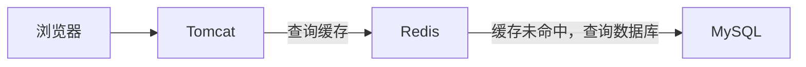
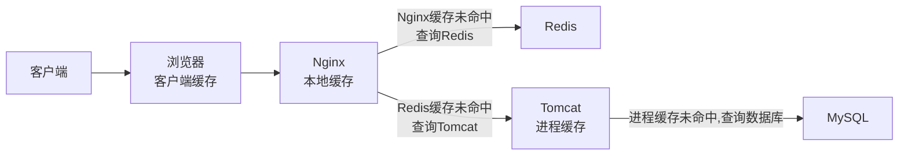
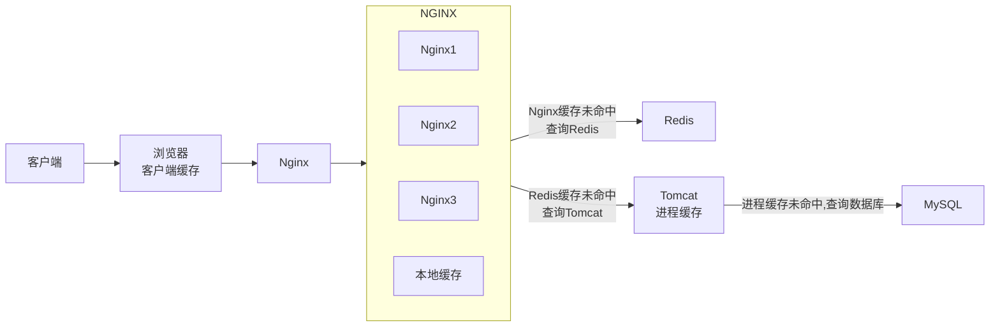
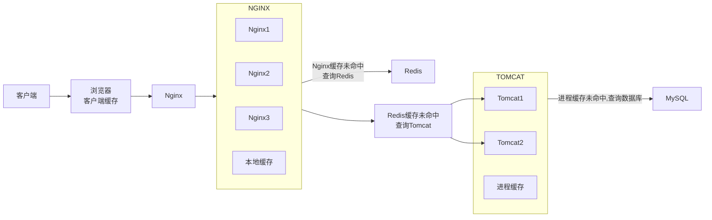
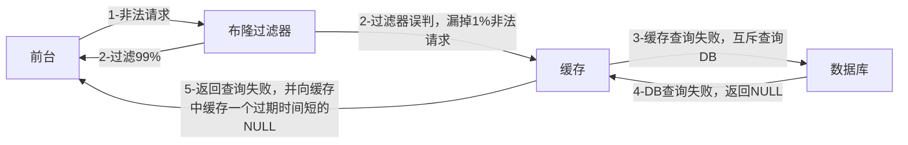
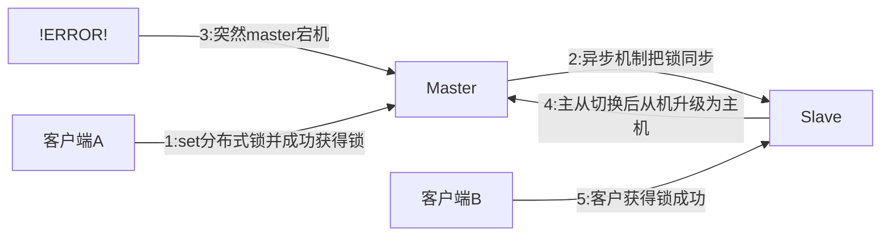

## 单线程VS多线程


## 大Key

### More Key

生产环境下，可能会有大量key，此时若想查找某个key，不能使用`keys *`，它的时间复杂度是O(n),会造成系统严重的卡顿。

诸如`keys`/`flushdb`/`flushall`等危险的命令应该在配置文件中禁用！

```conf
rename- command keys ""
rename- command flushdb ""
rename- command flushall ""
```

---

代替`keys`的查找命令为`scan`，其变体有`hscan`、`zscan`……

SCAN 命令是一个基于游标的迭代器，每次被调用之后， 都会向用户返回一个新的游标， 用户在下次迭代时需要使用这个新游标作为 SCAN 命令的游标参数， 以此来延续之前的迭代过程。

语法：

```shell
SCAN cursor [MATCH pattern] [COUNT count]
```

- cursor: 游标
- pattern: 匹配的模式
- count: 指定从数据集里返回多少元素，默认为 10 

SCAN 返回一个包含两个元素的数组

- 第一个元素是用于进行下一次迭代的新游标， 
- 第二个元素则是一个数组， 这个数组中包含了所有被迭代的元素。如果新游标返回零表示迭代已结束。 

SCAN的遍历顺序

非常特别，它不是从第一维数组的第零位一直遍历到末尾，而是采用了高位进位加法来遍历。之所以使用这样特殊的方式进行遍历，是考虑到字典的扩容和缩容时避免槽位的遍历重复和遗漏。

DEMO案例

```shell
127.0.0.1:6379> keys *
1) "k2"
2) "k1"
3) "k3"
127.0.0.1:6379> SCAN 0 MATCH * COUNT 1
1) "2"
2) 1) "k2"
   2) "k1"
127.0.0.1:6379> SCAN 2 MATCH * COUNT 1
1) "0"
2) 1) "k3"
```

### Big Key

**Big Key 判定规则**

- Key本身的数据量过大：一个String类型的Key，它的值为 5 MB
- Key中的成员数过多：一个ZSET类型的Key，它的成员数量为10,000个
- Key中成员的数据量过大：一个Hash类型的Key，它的成员数量虽然只有1,000个但这些成员的Value（值）总大小为100 MB

> 阿里开发规范：
>
> - String控制在 10KB,hash、list、zest、set元素个数不超过5000；
> - 非字符串的bigkey,不能使用del删除，要用hscan、sscan、zscan方式渐进删除，同时防止bigkey过期时间自动删除的问题

**Big Key的危害**

- 网络阻塞
  - 对BigKey执行读请求时，少量的QPS就可能导致带宽使用率被占满，导致Redis实例，乃至所在物理机变慢
- 数据倾斜
  - BigKey所在的Redis实例内存使用率远超其他实例，无法使数据分片的内存资源达到均衡
- Redis阻塞
  - 对元素较多的hash、list、zset等做运算会耗时较久，使主线程被阻塞
- CPU压力
  - 对BigKey的数据序列化和反序列化会导致CPU的使用率飙升，影响Redis实例和本机其它应用

**如何发现**

1. key小于10KB，则使用–bigkeys

```shell
# 每隔 100 条 scan 指令就会休眠 0.1s，ops 就不会剧烈抬升，但是扫描的时间会变长
redis-cli -h 127.0.0.1 -p 7001 –-bigkeys -i 0.1
```

2. 使用memory usage （此指令CPU占用率高，利用strlen、hlen等命令判断key的长度即可）

```shell
MEMORY USAGE key [SAMPLES count]
```

3. 利用第三方工具，如 Redis-Rdb-Tools 分析RDB快照文件，全面分析内存使用情况

   https://github.com/sripathikrishnan/redis-rdb-tools

4. 网络监控
   - 自定义工具，监控进出Redis的网络数据，超出预警值时主动告警
   - 一般阿里云搭建的云服务器就有相关监控页面

**如何删除**

- String：一般使用`del`,若过大则使用异步删除命令`unlink`

- hash:使用`hscan`每次获取少量的field-value,再使用`hdel`删除每个field

  - HSCAN 命令基本语法:`HSCAN key cursor [MATCH pattern] [COUNT count]`

    - cursor-游标
    - pattern-匹配的模式
    - count-指定从数据集里返回多少元素，默认值为 10

  - ```java
    public void delBigList(String host, int port, String password, String biglistKey) {
        Jedis jedis = new Jedis(host, port);
        if(password != null && !"".equals(password)) {
        	jedis.auth(password);
        }
        long llen = jedis.llen(bigListkey);
        int counter = 0;
        int left = 100;
        while(counter<llen){
            //每次从左侧截每100个
            jedis.ltrim(bigListKey, left, llen);
            counter += left;
            //最终删除key
            jedis.del(bigListkey);
        }
    }
    ```

  - 

- list:使用`ltrim`渐进式逐步删除，知道全部删除完成

  - `LTRIM KEY_NAME START STOP`:删除START——STOP之外的元素

  - ```java
    public void delBiglist(String host, int port, String password, String biglistKey) {
        Jedis jedis = new Jedis(host, port);
        if(password != null && !"".equals(password)) {
            jedis.auth(password);
            long llen = jedis.llen(bigListKey);
        }
        int counter =0;
        int left = 100;
        while(counter<llen) {
            //每次从左侧截每100个
            jedis.ltrim(bigListKey, left, llen);
            counter += left;
        }
        //最终删除key
        jedis.del(bigListKey);
    }
    ```

- set:使用`sscan`每次获取部分元素，再使用`srem`删除每个元素

  - ```java
    public void delBigSet(String host, int port, String password, String bigsetkey){
        Jedis jedis = new Jedis(host, port);
        if(password != null &&!"".equals(password)) {
        	jedis.auth(password);
        }
        ScanParams scanParams =new ScanParams().count(100);
        String cursor = “0”;
        do {
            ScanResult<String>scanResult = jedis.sscan(bigSetKey,cursor, scanParams);
            List<String>memberList=scanResult.getResult();
            if(memberList != null && !memberList.isEmpty()){
            	for(String member :memberList) {
            		jedis.srem(bigSetKey,member);
                }
            }
            cursor =scanResult.getStringCursor();
        } while(!"0".equals(cursor));
            
        //删除bigkey
        jedis.del(bigSetKey);
    }
    ```

- zset:使用`zscan`每次获取部分元素，再使用`zremrangebyrank`删除每个元素

  - ```java
    public void delBigZset(String host, int port, String password, String bigZsetKey) {
        Jedis jedis = new Jedis(host, port);
        if(password != null &&!"".equals(password)){
        	jedis.auth(password);
        }
        ScanParams scanParams =new ScanParams().count(100);
        String cursor =“0”;
        do {
            ScanResult<Tuple>scanResult = jedis.zscan(bigZsetKey, cursor, scanParams);
            List<Tuple>tupleList=scanResult.getResult();
            if(tupleList != null && !tupleList.isEmpty()){
            	for (Tuple tuple :tupleList){
            		jedis.zrem(bigZsetKey,tuple.getElement());
                }
            }
            cursor =scanResult.getStringCursor();
        } while(!"0".equals(cursor));
        //删除bigkey
        jedis.del(bigZsetkey);
    }
    ```

**生产调优**

在Redis配置文件中配置LAZY FREEING

```conf
lazy-free-lazy-server-del yes
replica-lazy-flush yes
lazyfree-lazy-user-del yes
```

### 恰当的Key设计

Redis的Key虽然可以自定义，但最好遵循下面的几个最佳实践约定：

- 遵循基本格式：[业务名称]:[数据名]:[id]
- 长度不超过44字节
- 不包含特殊字符

例如：我们的登录业务，保存用户信息，其key可以设计成如下格式：

`login:user:10`

- login:业务名称
- user:数据名称
- 10:数据ID

这样设计的好处：

- 可读性强
- 避免key冲突
- 方便管理
- 更节省内存： key是string类型，底层编码包含int、embstr和raw三种。embstr在小于44字节使用，采用连续内存空间，内存占用更小。当字节数大于44字节时，会转为raw模式存储，在raw模式下，内存空间不是连续的，而是采用一个指针指向了另外一段内存空间，在这段空间里存储SDS内容，这样空间不连续，访问的时候性能也就会收到影响，还有可能产生内存碎片

## 批处理优化

### 客户端与Redis的交互流程


Redis处理指令是很快的，主要花费的时候在于网络传输。于是乎很容易想到将多条指令批量的传输给redis


### MSet

Redis提供了很多Mxxx这样的命令，可以实现批量插入数据，例如：

- mset
- hmset

利用mset批量插入10万条数据

```java
@Test
void testMxx() {
    String[] arr = new String[2000];
    int j;
    long b = System.currentTimeMillis();
    for (int i = 1; i <= 100000; i++) {
        j = (i % 1000) << 1;
        arr[j] = "test:key_" + i;
        arr[j + 1] = "value_" + i;
        if (j == 0) {
            jedis.mset(arr);
        }
    }
    long e = System.currentTimeMillis();
    System.out.println("time: " + (e - b));
}
```

### Pipeline

MSET虽然可以批处理，但是却只能操作部分数据类型，因此如果有对复杂数据类型的批处理需要，建议使用Pipeline

```java
@Test
void testPipeline() {
    // 创建管道
    Pipeline pipeline = jedis.pipelined();
    long b = System.currentTimeMillis();
    for (int i = 1; i <= 100000; i++) {
        // 放入命令到管道
        pipeline.set("test:key_" + i, "value_" + i);
        if (i % 1000 == 0) {
            // 每放入1000条命令，批量执行
            pipeline.sync();
        }
    }
    long e = System.currentTimeMillis();
    System.out.println("time: " + (e - b));
}
```

### 集群下的批处理

如MSET或Pipeline这样的批处理需要在一次请求中携带多条命令，而此时如果Redis是一个集群，那批处理命令的多个key必须落在一个插槽中，否则就会导致执行失败。大家可以想一想这样的要求其实很难实现，因为我们在批处理时，可能一次要插入很多条数据，这些数据很有可能不会都落在相同的节点上，这就会导致报错了

有4种解决方案


- 第一种方案：串行执行，所以这种方式没有什么意义，当然，执行起来就很简单了，缺点就是耗时过久。

- 第二种方案：串行slot，简单来说，就是执行前，客户端先计算一下对应的key的slot，一样slot的key就放到一个组里边，不同的，就放到不同的组里边，然后对每个组执行pipeline的批处理，他就能串行执行各个组的命令，这种做法比第一种方法耗时要少，但是缺点呢，相对来说复杂一点，所以这种方案还需要优化一下

- 第三种方案：并行slot，相较于第二种方案，在分组完成后串行执行，第三种方案，就变成了并行执行各个命令，所以他的耗时就非常短，但是实现呢，也更加复杂。

- 第四种：hash_tag，redis计算key的slot的时候，其实是根据key的有效部分来计算的，通过这种方式就能一次处理所有的key，这种方式耗时最短，实现也简单，但是如果通过操作key的有效部分，那么就会导致所有的key都落在一个节点上，产生数据倾斜的问题，所以**推荐使用第三种方式**。

## 慢查询优化

**定义：**在Redis执行时耗时超过某个阈值的命令，称为慢查询。

**危害：**由于Redis是单线程的，所以当客户端发出指令后，他们都会进入到redis底层的queue来执行，如果此时有一些慢查询的数据，就会导致大量请求阻塞，从而引起报错，所以我们需要解决慢查询问题。

慢查询的阈值可以通过配置指定：

- slowlog-log-slower-than：慢查询阈值，单位是微秒。默认是10000，建议1000。

慢查询会被放入慢查询日志中，日志的长度有上限，可以通过配置指定：

- slowlog-max-len：慢查询日志（本质是一个队列）的长度。默认是128，建议1000。

修改这两个配置可以使用 `config set`命令。

**查看慢查询**

- `slowlog len`：查询慢查询日志长度
- `slowlog get [n]`：读取n条慢查询日志
- `slowlog reset`：清空慢查询列表


## 内存划分、配置

当Redis内存不足时，可能导致Key频繁被删除、响应时间变长、QPS不稳定等问题。当内存使用率达到90%以上时就需要我们警惕，并快速定位到内存占用的原因。

**碎片问题分析**

Redis底层分配并不是这个key有多大，他就会分配多大，而是有他自己的分配策略，比如8,16,20等等，假定当前key只需要10个字节，此时分配8肯定不够，那么他就会分配16个字节，多出来的6个字节就不能被使用，这就是我们常说的 碎片问题

**进程内存问题分析**

这片内存，通常都可以忽略不计

**缓冲区内存问题分析**

一般包括客户端缓冲区、AOF缓冲区、复制缓冲区等。客户端缓冲区又包括输入缓冲区和输出缓冲区两种。这部分内存占用波动较大，所以这片内存也是我们需要重点分析的内存问题。

| **内存占用** |                           **说明**                           |
| :----------: | :----------------------------------------------------------: |
|   数据内存   | 是Redis最主要的部分，存储Redis的键值信息。主要问题是BigKey问题、内存碎片问题 |
|   进程内存   | Redis主进程本身运⾏肯定需要占⽤内存，如代码、常量池等等；这部分内存⼤约⼏兆，在⼤多数⽣产环境中与Redis数据占⽤的内存相⽐可以忽略。 |
|  缓冲区内存  | 一般包括客户端缓冲区、AOF缓冲区、复制缓冲区等。客户端缓冲区又包括输入缓冲区和输出缓冲区两种。这部分内存占用波动较大，不当使用BigKey，可能导致内存溢出。 |

于是我们就需要通过一些命令，可以查看到Redis目前的内存分配状态：

* `info memory`：查看内存分配的情况
* `memory xxx`：查看key的主要占用情况

看到了这些配置，最关键的缓存区内存如何定位和解决呢？

内存缓冲区常见的有三种：

* 复制缓冲区：主从复制的repl_backlog_buf，如果太小可能导致频繁的全量复制，影响性能。通过replbacklog-size来设置，默认1MB
* AOF缓冲区：AOF刷盘之前的缓存区域，AOF执行rewrite的缓冲区。无法设置容量上限
* 客户端缓冲区：分为输入缓冲区和输出缓冲区，输入缓冲区最大1G且不能设置。输出缓冲区可以设置

复制缓冲区和AOF缓冲区不会有问题，最关键就是客户端缓冲区的问题

客户端缓冲区：指的就是我们发送命令时，客户端用来缓存命令的一个缓冲区，也就是我们向redis输入数据的输入端缓冲区和redis向客户端返回数据的响应缓存区，输入缓冲区最大1G且不能设置，所以这一块根本不用担心，如果超过了这个空间，redis会直接断开，因为本来此时此刻就代表着redis处理不过来了，我们需要担心的就是输出端缓冲区


在使用redis过程中，处理大量的big value，会导致输出结果过多，如果输出缓存区过大，会导致redis直接断开，而默认配置的情况下是没有大小的，内存可能一下子被占满，会直接导致redis断开，解决方案有两个

1、设置一个大小

2、增加我们带宽的大小，避免我们出现大量数据从而直接超过了redis的承受能力

## 多级缓存

传统的缓存策略一般是请求到达Tomcat后，先查询Redis，如果未命中则查询数据库



存在下面的问题：

- 请求要经过Tomcat处理，Tomcat的性能成为整个系统的瓶颈

- Redis缓存失效时，会对数据库产生冲击

多级缓存就是充分利用请求处理的每个环节，分别添加缓存，减轻Tomcat压力，提升服务性能：

- 浏览器访问静态资源时，优先读取浏览器本地缓存
- 访问非静态资源（ajax查询数据）时，访问服务端
- 请求到达Nginx后，优先读取Nginx本地缓存
- 如果Nginx本地缓存未命中，则去直接查询Redis（不经过Tomcat）
- 如果Redis查询未命中，则查询Tomcat
- 请求进入Tomcat后，优先查询JVM进程缓存
- 如果JVM进程缓存未命中，则查询数据库



在多级缓存架构中，Nginx内部需要编写本地缓存查询、Redis查询、Tomcat查询的业务逻辑，因此这样的nginx服务不再是一个**反向代理服务器**，而是一个编写**业务的Web服务器了**。

因此这样的业务Nginx服务也需要搭建集群来提高并发，再有专门的nginx服务来做反向代理，如图：



另外，我们的Tomcat服务将来也会部署为集群模式：



可见，多级缓存的关键有两个：

- 一个是在nginx中编写业务，实现nginx本地缓存、Redis、Tomcat的查询
  - OpenResty框架结合Lua语言

- 另一个就是在Tomcat中实现JVM进程缓存
  - Caffeine


## 缓存双写一致性更新策略

### 同步策略

缓存数据同步的常见方式有三种：

**设置有效期**：给缓存设置有效期，到期后自动删除。再次查询时更新

- 优势：简单、方便
- 缺点：时效性差，缓存过期之前可能不一致
- 场景：更新频率较低，时效性要求低的业务

**同步双写**：在修改数据库的同时，直接修改缓存

- 优势：时效性强，缓存与数据库强一致
- 缺点：有代码侵入，耦合度高；
- 场景：对一致性、时效性要求较高的缓存数据

**异步通知：**修改数据库时发送事件通知，相关服务监听到通知后修改缓存数据

- 优势：低耦合，可以同时通知多个缓存服务
- 缺点：时效性一般，可能存在中间不一致状态
- 场景：时效性要求一般，有多个服务需要同步

### 同步双写更新策略

**先更新数据库后删除缓存**

- 尝试使用双检加锁机制lock住MySQL，只让一个请求线程回写Redis，完成数据一致性。
- 当MySQL有记录改动时，若想立刻同步反应到Redis，可以使用Canal 、 Flink CDC这样的框架。
- 可以把要删除的缓存值或是要更新的数据库值暂存到消息队列中，当程序没有成功地删除缓存或更新数据库时，可以从消息队列中重新读取这些值，然后再次进行删除或更新。
- 如果业务层要求必须读取一致性的数据，那就需要在更新数据库时，先在Redis缓存客户端暂停并发读请求，等数据库更新完、缓存值删除后，再读取数据，从而保证数据一致性，这是理论可以达到的效果，但实际不推荐，真实生产环境中，分布式下很难做到实时一致性，一般都是最终一致性。

**延时双删**

- 先删除缓存，预估其它业务的等待时间，休眠对应的时间后再次删除缓存。其它线程读取数据时发现缓存缺失，就会从数据库中读取最新的值了。
- 若想回避延时带来的吞吐量降低，可以将第二次删除改成异步操作。

### 异步通知更新策略

1. 消息队列

   ```mermaid
   flowchart LR
   客户端 -->|修改商品| item-service -->|1.1写入数据库| MySQL
   item-service -->|1.2发布消息| MQ -->|2.1监听消息| cache-service -->|2.2更新缓存| Redis
   ```

   - 商品服务完成对数据的修改后，只需要发送一条消息到MQ中。
   - 缓存服务监听MQ消息，然后完成对缓存的更新

   有少量的代码侵入

2. Canal

   ```mermaid
   flowchart LR
   客户端 -->|修改商品| item-service -->|1.写入数据库| MySQL --> Canal\n2.1监听MySQL的binlog --> |2.2通知数据变更情况| cache-service -->|2.3更新缓存| Redis
   ```

   - 商品服务完成商品修改后，业务直接结束，没有任何代码侵入
   - Canal监听MySQL变化，当发现变化后，立即通知缓存服务
   - 缓存服务接收到canal通知，更新缓存

   代码零侵入

3. Flink CDC

## HyperLogLog

为什么只占用12KB？

每个 HyperLogLog 实例将输入的哈希值分布到 **16384 个寄存器**（也称为桶或槽）中，每个寄存器存储某个哈希值的 "前导零" 的最大长度。由于 Redis 采用 6 位来存储每个寄存器的最大前导零长度，因此 **16384 个寄存器** 需要：

```txt
16384 (寄存器数) × 6 (每个寄存器占用的位) / 8 (每字节位数) = 12288 字节 = 12 KB
```

---

案例：亿级UV的Redis统计方案

```java
@Service
@Slf4j
public class HyperLogLogService
{
    @Resource
    private RedisTemplate redisTemplate;

    /**
     * 模拟后台有用户点击首页，每个用户来自不同ip地址
     */
    @PostConstruct
    public void init()
    {
        log.info("------模拟后台有用户点击首页，每个用户来自不同ip地址");
        new Thread(() -> {
            String ip = null;
            for (int i = 1; i <=200; i++) {
                Random r = new Random();
                ip = r.nextInt(256) + "." + r.nextInt(256) + "." + r.nextInt(256) + "." + r.nextInt(256);

                Long hll = redisTemplate.opsForHyperLogLog().add("hll", ip);
                log.info("ip={},该ip地址访问首页的次数={}",ip,hll);
                //暂停几秒钟线程
                try { TimeUnit.SECONDS.sleep(3); } catch (InterruptedException e) { e.printStackTrace(); }
            }
        },"t1").start();
    }

}
```

```java
@RestController
@Slf4j
public class HyperLogLogController
{
    @Resource
    private RedisTemplate redisTemplate;

    @GetMapping(value = "/uv")
    public long uv()
    {
        //pfcount
        return redisTemplate.opsForHyperLogLog().size("hll");
    }

}
```

## GEO

案例代码

```java
@Service
@Slf4j
public class GeoService
{
    public static final String CITY ="city";

    @Autowired
    private RedisTemplate redisTemplate;

    public String geoAdd()
    {
        Map<String, Point> map= new HashMap<>();
        map.put("天安门",new Point(116.403963,39.915119));
        map.put("故宫",new Point(116.403414 ,39.924091));
        map.put("长城" ,new Point(116.024067,40.362639));

        redisTemplate.opsForGeo().add(CITY,map);

        return map.toString();
    }

    public Point position(String member) {
        //获取经纬度坐标
        List<Point> list= this.redisTemplate.opsForGeo().position(CITY,member);
        return list.get(0);
    }


    public String hash(String member) {
        //geohash算法生成的base32编码值
        List<String> list= this.redisTemplate.opsForGeo().hash(CITY,member);
        return list.get(0);
    }


    public Distance distance(String member1, String member2) {
        //获取两个给定位置之间的距离
        Distance distance= this.redisTemplate.opsForGeo().distance(CITY,member1,member2, RedisGeoCommands.DistanceUnit.KILOMETERS);
        return distance;
    }

    public GeoResults radiusByxy() {
        //通过经度，纬度查找附近的,北京王府井位置116.418017,39.914402
        Circle circle = new Circle(116.418017, 39.914402, Metrics.KILOMETERS.getMultiplier());
        //返回50条
        RedisGeoCommands.GeoRadiusCommandArgs args = RedisGeoCommands.GeoRadiusCommandArgs.newGeoRadiusArgs().includeDistance().includeCoordinates().sortAscending().limit(50);
        GeoResults<RedisGeoCommands.GeoLocation<String>> geoResults= this.redisTemplate.opsForGeo().radius(CITY,circle, args);
        return geoResults;
    }

    public GeoResults radiusByMember() {
        //通过地方查找附近
        String member="天安门";
        //返回50条
        RedisGeoCommands.GeoRadiusCommandArgs args = RedisGeoCommands.GeoRadiusCommandArgs.newGeoRadiusArgs().includeDistance().includeCoordinates().sortAscending().limit(50);
        //半径10公里内
        Distance distance=new Distance(10, Metrics.KILOMETERS);
        GeoResults<RedisGeoCommands.GeoLocation<String>> geoResults= this.redisTemplate.opsForGeo().radius(CITY,member, distance,args);
        return geoResults;
    }
}
```

```java
@Api(tags = "美团地图位置附近的酒店推送GEO")
@RestController
@Slf4j
public class GeoController
{
    @Resource
    private GeoService geoService;

    @ApiOperation("添加坐标geoadd")
    @RequestMapping(value = "/geoadd",method = RequestMethod.GET)
    public String geoAdd()
    {
        return geoService.geoAdd();
    }

    @ApiOperation("获取经纬度坐标geopos")
    @RequestMapping(value = "/geopos",method = RequestMethod.GET)
    public Point position(String member)
    {
        return geoService.position(member);
    }

    @ApiOperation("获取经纬度生成的base32编码值geohash")
    @RequestMapping(value = "/geohash",method = RequestMethod.GET)
    public String hash(String member)
    {
        return geoService.hash(member);
    }

    @ApiOperation("获取两个给定位置之间的距离")
    @RequestMapping(value = "/geodist",method = RequestMethod.GET)
    public Distance distance(String member1, String member2)
    {
        return geoService.distance(member1,member2);
    }

    @ApiOperation("通过经度纬度查找北京王府井附近的")
    @RequestMapping(value = "/georadius",method = RequestMethod.GET)
    public GeoResults radiusByxy()
    {
        return geoService.radiusByxy();
    }

    @ApiOperation("通过地方查找附近,本例写死天安门作为地址")
    @RequestMapping(value = "/georadiusByMember",method = RequestMethod.GET)
    public GeoResults radiusByMember()
    {
        return geoService.radiusByMember();
    }

}
```

## 布隆过滤器

布隆过滤器(Bloom Filter) 是一种专门用来解决去重问题的高级数据结构。

实质就是一个大型位数组和几个不同的无偏hash函数(无偏表示分布均匀)。由一个初值都为零的bit数组和多个哈希函数构成，用来快速判断某个数据是否存在。但是跟 HyperLogLog 一样，它也一样有那么一点点不精确，也存在一定的误判概率

**特点**

- 不能删除元素：标准布隆过滤器不支持删除操作，因为删除操作可能会影响其他元素的查询结果。
- 判定元素是否存在时：存在代表大概率存在；不存在代表一定不存在。

**原理**

- 添加key时：使用多个hash函数对key进行hash运算得到一个整数索引值，对位数组长度进行取模运算得到一个位置，每个hash函数都会得到一个不同的位置，将这几个位置都置1就完成了add操作。
- 查询key时：只要有其中一位是零就表示这个key不存在，但如果都是1，则不一定存在对应的key。

**案例**

```java
@Component
@Slf4j
public class BloomFilterInit
{
    @Resource
    private RedisTemplate redisTemplate;

    @PostConstruct//初始化白名单数据，故意差异化数据演示效果......
    public void init()
    {
        //白名单客户预加载到布隆过滤器
        String uid = "customer:12";
        //1 计算hashcode，由于可能有负数，直接取绝对值
        int hashValue = Math.abs(uid.hashCode());
        //2 通过hashValue和2的32次方取余后，获得对应的下标坑位
        long index = (long) (hashValue % Math.pow(2, 32));
        log.info(uid+" 对应------坑位index:{}",index);
        //3 设置redis里面bitmap对应坑位，该有值设置为1
        redisTemplate.opsForValue().setBit("whitelistCustomer",index,true);
    }
}
```

```java
@Component
@Slf4j
public class CheckUtils
{
    @Resource
    private RedisTemplate redisTemplate;

    public boolean checkWithBloomFilter(String checkItem,String key)
    {
        int hashValue = Math.abs(key.hashCode());
        long index = (long) (hashValue % Math.pow(2, 32));
        boolean existOK = redisTemplate.opsForValue().getBit(checkItem, index);
        log.info("----->key:"+key+"\t对应坑位index:"+index+"\t是否存在:"+existOK);
        return existOK;
    }
}
```

```java
@Service
@Slf4j
public class CustomerSerivce
{
    public static final String CACHE_KEY_CUSTOMER = "customer:";

    @Resource
    private CustomerMapper customerMapper;
    @Resource
    private RedisTemplate redisTemplate;

    @Resource
    private CheckUtils checkUtils;

    public void addCustomer(Customer customer){
        int i = customerMapper.insertSelective(customer);

        if(i > 0)
        {
            //到数据库里面，重新捞出新数据出来，做缓存
            customer=customerMapper.selectByPrimaryKey(customer.getId());
            //缓存key
            String key=CACHE_KEY_CUSTOMER+customer.getId();
            //往mysql里面插入成功随后再从mysql查询出来，再插入redis
            redisTemplate.opsForValue().set(key,customer);
        }
    }

    public Customer findCustomerById(Integer customerId){
        Customer customer = null;

        //缓存key的名称
        String key=CACHE_KEY_CUSTOMER+customerId;

        //1 查询redis
        customer = (Customer) redisTemplate.opsForValue().get(key);

        //redis无，进一步查询mysql
        if(customer==null)
        {
            //2 从mysql查出来customer
            customer=customerMapper.selectByPrimaryKey(customerId);
            // mysql有，redis无
            if (customer != null) {
                //3 把mysql捞到的数据写入redis，方便下次查询能redis命中。
                redisTemplate.opsForValue().set(key,customer);
            }
        }
        return customer;
    }

    /**
     * BloomFilter → redis → mysql
     * 白名单：whitelistCustomer
     * @param customerId
     * @return
     */

    @Resource
    private CheckUtils checkUtils;
    public Customer findCustomerByIdWithBloomFilter (Integer customerId)
    {
        Customer customer = null;

        //缓存key的名称
        String key = CACHE_KEY_CUSTOMER + customerId;

        //布隆过滤器check，无是绝对无，有是可能有
        //===============================================
        if(!checkUtils.checkWithBloomFilter("whitelistCustomer",key))
        {
            log.info("白名单无此顾客信息:{}",key);
            return null;
        }
        //===============================================

        //1 查询redis
        customer = (Customer) redisTemplate.opsForValue().get(key);
        //redis无，进一步查询mysql
        if (customer == null) {
            //2 从mysql查出来customer
            customer = customerMapper.selectByPrimaryKey(customerId);
            // mysql有，redis无
            if (customer != null) {
                //3 把mysql捞到的数据写入redis，方便下次查询能redis命中。
                redisTemplate.opsForValue().set(key, customer);
            }
        }
        return customer;
    }
}
```

```java
@Api(tags = "客户Customer接口+布隆过滤器讲解")
@RestController
@Slf4j
public class CustomerController
{
    @Resource private CustomerSerivce customerSerivce;

    @ApiOperation("数据库初始化2条Customer数据")
    @RequestMapping(value = "/customer/add", method = RequestMethod.POST)
    public void addCustomer() {
        for (int i = 0; i < 2; i++) {
            Customer customer = new Customer();

            customer.setCname("customer"+i);
            customer.setAge(new Random().nextInt(30)+1);
            customer.setPhone("1381111xxxx");
            customer.setSex((byte) new Random().nextInt(2));
            customer.setBirth(Date.from(LocalDateTime.now().atZone(ZoneId.systemDefault()).toInstant()));

            customerSerivce.addCustomer(customer);
        }
    }

    @ApiOperation("单个用户查询，按customerid查用户信息")
    @RequestMapping(value = "/customer/{id}", method = RequestMethod.GET)
    public Customer findCustomerById(@PathVariable int id) {
        return customerSerivce.findCustomerById(id);
    }

    @ApiOperation("BloomFilter案例讲解")
    @RequestMapping(value = "/customerbloomfilter/{id}", method = RequestMethod.GET)
    public Customer findCustomerByIdWithBloomFilter(@PathVariable int id) throws ExecutionException, InterruptedException
    {
        return customerSerivce.findCustomerByIdWithBloomFilter(id);
    }
}
```

**布谷鸟过滤器**

能够解决布隆过滤器不能删除元素的问题，但成熟度和使用率不如布隆过滤器

## 缓存预热、穿透、击穿、雪崩

### 缓存预热

对于热点key，事先在`@postconstrct`中初始化白名单数据

### 缓存雪崩

缓存雪崩是指在分布式系统中，当大量缓存同时过期或失效，导致大量请求直接访问后端数据库，从而引发数据库负载骤增，可能造成系统崩溃的现象。

**预防/解决**

1. 将key设置为永不过期、随机的过期时间
2. 缓存集群实现高可用
   - 主从+哨兵
   - Redis Cluster
   - 开启AOF、RDB，尽快恢复缓存集群
3. 双重缓存
   - ehcache本地缓存
   - Redis缓存
4. 服务限流、降级
   - Hystrix
   - Sentinel
5. 购买Redis云数据库

### 缓存穿透

定义：查询的数据不存在于Redis，也不存在于MySQL，频繁的此类查询会导致数据库压力过大而宕机。

**解决方案**

1. 缓存空对象
2. Google的布隆过滤器Guava




### 缓存击穿

定义：大量的请求同时查询某个key，此时这个key突然失效，导致大量请求打到数据库上。

解决方案

1. 热点key不设置过期时间
2. 采用双检加锁互斥更新
3. 逻辑过期异步更新数据

## 分布式锁

**特性**

- 独占性：任何时刻只能有一个线程持有
- 高可用：集群环境下，不能因为某个节点宕机而出现获取锁/释放锁失败的情况
- 防死锁：有超时控制机制或撤销操作，有一个兜底的跳出方案
- 不乱抢：自己的锁只能自己释放，A线程不能 unlock B线程的锁
- 重入性：同一个节点的同一个线程获得锁之后，能够再次获取这个锁

**自定义实现**

```JAVA
@Component
public class DistributedLockFactory
{
    @Autowired
    private StringRedisTemplate stringRedisTemplate;
    private String lockName;
    private String uuidValue;

    public DistributedLockFactory()
    {
        this.uuidValue = IdUtil.simpleUUID();//UUID
    }

    public Lock getDistributedLock(String lockType)
    {
        if(lockType == null) return null;

        if(lockType.equalsIgnoreCase("REDIS")){
            lockName = "zzyyRedisLock";
            return new RedisDistributedLock(stringRedisTemplate,lockName,uuidValue);
        } else if(lockType.equalsIgnoreCase("ZOOKEEPER")){
            //TODO zookeeper版本的分布式锁实现
            return new ZookeeperDistributedLock();
        } else if(lockType.equalsIgnoreCase("MYSQL")){
            //TODO mysql版本的分布式锁实现
            return null;
        }
        return null;
    }
}
```

```JAVA
public class RedisDistributedLock implements java.util.concurrent.locks.Lock {
    private final StringRedisTemplate stringRedisTemplate;
    private final String lockName; // KEYS[1]
    private final String uuidValue; // ARGV[1]
    private long expireTime; // ARGV[2] in seconds

    private ScheduledExecutorService scheduler;

    public RedisDistributedLock(StringRedisTemplate stringRedisTemplate, String lockName, String uuidValue) {
        this.stringRedisTemplate = stringRedisTemplate;
        this.lockName = lockName;
        this.uuidValue = uuidValue + ":" + Thread.currentThread().getId();
        this.expireTime = 30L;
        this.scheduler = new ScheduledThreadPoolExecutor(1);
    }

    @Override
    public void lock() {
        tryLock(-1L, TimeUnit.SECONDS);
    }

    @Override
    public boolean tryLock() {
        try {
            return tryLock(-1L, TimeUnit.SECONDS);
        } catch (InterruptedException e) {
            Thread.currentThread().interrupt();
            return false;
        }
    }

    @Override
    public boolean tryLock(long time, TimeUnit unit) throws InterruptedException {
        if (time != -1L) {
            this.expireTime = unit.toSeconds(time);
        }

        String script =
                "if redis.call('exists', KEYS[1]) == 0 or redis.call('hexists', KEYS[1], ARGV[1]) == 1 then " +
                        "redis.call('hincrby', KEYS[1], ARGV[1], 1) " +
                        "redis.call('expire', KEYS[1], ARGV[2]) " +
                        "return 1 " +
                        "else " +
                        "return 0 " +
                        "end";

        while (!stringRedisTemplate.execute(new DefaultRedisScript<>(script, Boolean.class), Arrays.asList(lockName), uuidValue, String.valueOf(expireTime))) {
            TimeUnit.MILLISECONDS.sleep(50);
        }
        renewExpire();
        return true;
    }

    @Override
    public void unlock() {
        String script =
                "if redis.call('hexists', KEYS[1], ARGV[1]) == 0 then " +
                        "return nil " +
                        "elseif redis.call('hincrby', KEYS[1], ARGV[1], -1) == 0 then " +
                        "return redis.call('del', KEYS[1]) " +
                        "else " +
                        "return 0 " +
                        "end";

        Long flag = stringRedisTemplate.execute(new DefaultRedisScript<>(script, Long.class), Arrays.asList(lockName), uuidValue, String.valueOf(expireTime));
        if (flag == null) {
            throw new RuntimeException("This lock doesn't EXIST");
        }
        if (scheduler != null) {
            scheduler.shutdownNow();
        }
    }

    private void renewExpire() {
        String script =
                "if redis.call('hexists', KEYS[1], ARGV[1]) == 1 then " +
                        "return redis.call('expire', KEYS[1], ARGV[2]) " +
                        "else " +
                        "return 0 " +
                        "end";

        scheduler.scheduleAtFixedRate(() -> {
            if (stringRedisTemplate.execute(new DefaultRedisScript<>(script, Boolean.class), Arrays.asList(lockName), uuidValue, String.valueOf(expireTime))) {
                renewExpire();
            }
        }, (this.expireTime * 1000) / 3, (this.expireTime * 1000) / 3, TimeUnit.MILLISECONDS);
    }

    @Override
    public void lockInterruptibly() throws InterruptedException {
        try {
            if (!tryLock(-1L, TimeUnit.SECONDS)) {
                throw new InterruptedException();
            }
        } catch (InterruptedException e) {
            throw e;
        }
    }

    @Override
    public Condition newCondition() {
        throw new UnsupportedOperationException("Distributed locks do not support conditions");
    }
}
```

```JAVA
@Service
@Slf4j
public class InventoryService
{
    @Autowired
    private StringRedisTemplate stringRedisTemplate;
    @Value("${server.port}")
    private String port;
    @Autowired
    private DistributedLockFactory distributedLockFactory;

    public String sale()
    {
        String retMessage = "";
        Lock redisLock = distributedLockFactory.getDistributedLock("redis");
        redisLock.lock();
        try
        {
            //1 查询库存信息
            String result = stringRedisTemplate.opsForValue().get("inventory001");
            //2 判断库存是否足够
            Integer inventoryNumber = result == null ? 0 : Integer.parseInt(result);
            //3 扣减库存
            if(inventoryNumber > 0) {
                stringRedisTemplate.opsForValue().set("inventory001",String.valueOf(--inventoryNumber));
                retMessage = "成功卖出一个商品，库存剩余: "+inventoryNumber;
                System.out.println(retMessage);
                //暂停几秒钟线程,为了测试自动续期
                try { TimeUnit.SECONDS.sleep(120); } catch (InterruptedException e) { e.printStackTrace(); }
            }else{
                retMessage = "商品卖完了，o(╥﹏╥)o";
            }
        }catch (Exception e){
            e.printStackTrace();
        }finally {
            redisLock.unlock();
        }
        return retMessage+"\t"+"服务端口号："+port;
    }


    private void testReEnter()
    {
        Lock redisLock = distributedLockFactory.getDistributedLock("redis");
        redisLock.lock();
        try
        {
            System.out.println("################测试可重入锁####################################");
        }finally {
            redisLock.unlock();
        }
    }
}
```

### 红锁

**产生背景**



1. 客户A通过Redis的set命令成功建立分布式锁并持有锁
2. 正常情况下主从机都有分布式锁
3. 突然出现故障，但Master还没来得及同步数据给Slave，此时Slave机器上没有对应的锁信息
4. 从机Slave上位，变成新的Master主机
5. 客户B建锁成功，此时出现了：两个线程获取到了锁，可能会导致各种意外情况发生，例如脏读

> CAP定理的CP遭到了破坏，并且Redis无论单机、主从、哨兵均有此风险

Redlock算法，用来实现**基于多个实例的**分布式锁。

锁变量由多个实例维护，即使有实例发生了故障，锁变量仍然是存在的，客户端还是可以完成锁操作。

该方案基于（set 加锁、Lua 脚本解锁）进行改良，大致方案如下：

假设我们有N个Redis主节点，例如 N = 5，这些节点是完全独立的，不使用复制或任何其他隐式协调系统，为了取到锁，客户端执行以下操作：

1. 获取当前时间，以毫秒为单位
2. 依次尝试从5个实例，使用相同的 key 和随机值（例如 UUID）获取锁。当向Redis 请求获取锁时，客户端应该设置一个超时时间，这个超时时间应该小于锁的失效时间。例如你的锁自动失效时间为 10 秒，则超时时间应该在 5-50 毫秒之间。这样可以防止客户端在试图与一个宕机的 Redis 节点对话时长时间处于阻塞状态。如果一个实例不可用，客户端应该尽快尝试去另外一个 Redis 实例请求获取锁；
3. 客户端通过当前时间减去步骤 1 记录的时间来计算获取锁使用的时间。当且仅当从大多数（N/2+1，这里是 3 个节点）的 Redis 节点都取到锁，并且获取锁使用的时间小于锁失效时间时，锁才算获取成功；
4. 如果取到了锁，其真正有效时间等于初始有效时间减去获取锁所使用的时间（步骤 3 计算的结果）。
5. 如果由于某些原因未能获得锁（无法在至少 N/2 + 1 个 Redis 实例获取锁、或获取锁的时间超过了有效时间），客户端应该在所有的 Redis 实例上进行解锁（即便某些Redis实例根本就没有加锁成功，防止某些节点获取到锁但是客户端没有得到响应而导致接下来的一段时间不能被重新获取锁）。

> 该方案为了解决数据不一致的问题，直接舍弃了异步复制只使用 master 节点，同时由于舍弃了slave，为了保证可用性，引入了N个节点，官方建议是 5

**watch_dog自动延期机制**

客户端A加锁成功，就会启动一个watch dog看门狗，他是一个后台线程，会每隔10秒检查一下，如果客户端A还持有锁key，那么就会不断的延长锁key的生存时间，默认每次续命又从30秒新开始

### Redission

**快速上手**

```xml
<dependency>
    <groupId>org.redisson</groupId>
    <artifactId>redisson</artifactId>
    <version>3.13.4</version>
</dependency>
```

```java
@Configuration
public class RedisConfig
{
    @Bean
    public RedisTemplate<String, Object> redisTemplate(LettuceConnectionFactory lettuceConnectionFactory)
    {
        RedisTemplate<String,Object> redisTemplate = new RedisTemplate<>();
        redisTemplate.setConnectionFactory(lettuceConnectionFactory);
        //设置key序列化方式string
        redisTemplate.setKeySerializer(new StringRedisSerializer());
        //设置value的序列化方式json
        redisTemplate.setValueSerializer(new GenericJackson2JsonRedisSerializer());

        redisTemplate.setHashKeySerializer(new StringRedisSerializer());
        redisTemplate.setHashValueSerializer(new GenericJackson2JsonRedisSerializer());

        redisTemplate.afterPropertiesSet();

        return redisTemplate;
    }

    //单Redis节点模式
    @Bean
    public Redisson redisson()
    {
        Config config = new Config();
        config.useSingleServer().setAddress("redis://192.168.111.175:6379").setDatabase(0).setPassword("111111");
        return (Redisson) Redisson.create(config);
    }
}
```

```java
@RestController
@Api(tags = "redis分布式锁测试")
public class InventoryController
{
    @Autowired
    private InventoryService inventoryService;

    @ApiOperation("扣减库存，一次卖一个")
    @GetMapping(value = "/inventory/sale")
    public String sale()
    {
        return inventoryService.sale();
    }

    @ApiOperation("扣减库存saleByRedisson，一次卖一个")
    @GetMapping(value = "/inventory/saleByRedisson")
    public String saleByRedisson()
    {
        return inventoryService.saleByRedisson();
    }
}
```

```java
@Service
@Slf4j
public class InventoryService
{
    @Autowired
    private StringRedisTemplate stringRedisTemplate;
    @Value("${server.port}")
    private String port;
    @Autowired
    private DistributedLockFactory distributedLockFactory;

    @Autowired
    private Redisson redisson;
    public String saleByRedisson()
    {
        String retMessage = "";
        String key = "zzyyRedisLock";
        RLock redissonLock = redisson.getLock(key);
        redissonLock.lock();
        try
        {
            //1 查询库存信息
            String result = stringRedisTemplate.opsForValue().get("inventory001");
            //2 判断库存是否足够
            Integer inventoryNumber = result == null ? 0 : Integer.parseInt(result);
            //3 扣减库存
            if(inventoryNumber > 0) {
                stringRedisTemplate.opsForValue().set("inventory001",String.valueOf(--inventoryNumber));
                retMessage = "成功卖出一个商品，库存剩余: "+inventoryNumber;
                System.out.println(retMessage);
            }else{
                retMessage = "商品卖完了，o(╥﹏╥)o";
            }
        }finally {
            if(redissonLock.isLocked() && redissonLock.isHeldByCurrentThread())
            {
                redissonLock.unlock();
            }
        }
        return retMessage+"\t"+"服务端口号："+port;
    }
}
```

**多机案例**

```properties
spring.redis.database=0
spring.redis.password=
spring.redis.timeout=3000
spring.redis.mode=single

spring.redis.pool.conn-timeout=3000
spring.redis.pool.so-timeout=3000
spring.redis.pool.size=10

spring.redis.single.address1=192.168.111.185:6381
spring.redis.single.address2=192.168.111.185:6382
spring.redis.single.address3=192.168.111.185:6383
```

```java
@Configuration
@EnableConfigurationProperties(RedisProperties.class)
public class CacheConfiguration {

    @Autowired
    RedisProperties redisProperties;

    @Bean
    RedissonClient redissonClient1() {
        Config config = new Config();
        String node = redisProperties.getSingle().getAddress1();
        node = node.startsWith("redis://") ? node : "redis://" + node;
        SingleServerConfig serverConfig = config.useSingleServer()
                .setAddress(node)
                .setTimeout(redisProperties.getPool().getConnTimeout())
                .setConnectionPoolSize(redisProperties.getPool().getSize())
                .setConnectionMinimumIdleSize(redisProperties.getPool().getMinIdle());
        if (StringUtils.isNotBlank(redisProperties.getPassword())) {
            serverConfig.setPassword(redisProperties.getPassword());
        }
        return Redisson.create(config);
    }

    @Bean
    RedissonClient redissonClient2() {
        Config config = new Config();
        String node = redisProperties.getSingle().getAddress2();
        node = node.startsWith("redis://") ? node : "redis://" + node;
        SingleServerConfig serverConfig = config.useSingleServer()
                .setAddress(node)
                .setTimeout(redisProperties.getPool().getConnTimeout())
                .setConnectionPoolSize(redisProperties.getPool().getSize())
                .setConnectionMinimumIdleSize(redisProperties.getPool().getMinIdle());
        if (StringUtils.isNotBlank(redisProperties.getPassword())) {
            serverConfig.setPassword(redisProperties.getPassword());
        }
        return Redisson.create(config);
    }

    @Bean
    RedissonClient redissonClient3() {
        Config config = new Config();
        String node = redisProperties.getSingle().getAddress3();
        node = node.startsWith("redis://") ? node : "redis://" + node;
        SingleServerConfig serverConfig = config.useSingleServer()
                .setAddress(node)
                .setTimeout(redisProperties.getPool().getConnTimeout())
                .setConnectionPoolSize(redisProperties.getPool().getSize())
                .setConnectionMinimumIdleSize(redisProperties.getPool().getMinIdle());
        if (StringUtils.isNotBlank(redisProperties.getPassword())) {
            serverConfig.setPassword(redisProperties.getPassword());
        }
        return Redisson.create(config);
    }


    /**
     * 单机
     */
    /*@Bean
    public Redisson redisson()
    {
        Config config = new Config();

        config.useSingleServer().setAddress("redis://192.168.111.147:6379").setDatabase(0);

        return (Redisson) Redisson.create(config);
    }*/

}
```

```java
@Data
public class RedisPoolProperties {

    private int maxIdle;

    private int minIdle;

    private int maxActive;

    private int maxWait;

    private int connTimeout;

    private int soTimeout;

    /**
     * 池大小
     */
    private  int size;

}
```

```java
@ConfigurationProperties(prefix = "spring.redis", ignoreUnknownFields = false)
@Data
public class RedisProperties {

    private int database;

    /**
     * 等待节点回复命令的时间。该时间从命令发送成功时开始计时
     */
    private int timeout;

    private String password;

    private String mode;

    /**
     * 池配置
     */
    private RedisPoolProperties pool;

    /**
     * 单机信息配置
     */
    private RedisSingleProperties single;
}
```

```java
@Data
public class RedisSingleProperties {
    private  String address1;
    private  String address2;
    private  String address3;
}
```

```java
@RestController
@Slf4j
public class RedLockController {

    public static final String CACHE_KEY_REDLOCK = "ATGUIGU_REDLOCK";

    @Autowired
    RedissonClient redissonClient1;

    @Autowired
    RedissonClient redissonClient2;

    @Autowired
    RedissonClient redissonClient3;

    boolean isLockBoolean;

    @GetMapping(value = "/multiLock")
    public String getMultiLock() throws InterruptedException
    {
        String uuid =  IdUtil.simpleUUID();
        String uuidValue = uuid+":"+Thread.currentThread().getId();

        RLock lock1 = redissonClient1.getLock(CACHE_KEY_REDLOCK);
        RLock lock2 = redissonClient2.getLock(CACHE_KEY_REDLOCK);
        RLock lock3 = redissonClient3.getLock(CACHE_KEY_REDLOCK);

        RedissonMultiLock redLock = new RedissonMultiLock(lock1, lock2, lock3);
        redLock.lock();
        try
        {
            System.out.println(uuidValue+"\t"+"---come in biz multiLock");
            try { TimeUnit.SECONDS.sleep(30); } catch (InterruptedException e) { e.printStackTrace(); }
            System.out.println(uuidValue+"\t"+"---task is over multiLock");
        } catch (Exception e) {
            e.printStackTrace();
            log.error("multiLock exception ",e);
        } finally {
            redLock.unlock();
            log.info("释放分布式锁成功key:{}", CACHE_KEY_REDLOCK);
        }

        return "multiLock task is over  "+uuidValue;
    }

}
```

## 缓存过期淘汰策略

### 默认内存配置

查看Redis内存使用情况

- `info memory`
- `config get memory`

修改默认内存大小：

- 打开Redis配置文件，设置maxmemory参数，单位是字节，（64位操作系统下，设置0代表无上限）设置推荐为物理机的3/4
- 使用命令：`config set maxmemory 1234`(该方式单次生效，重启后失效)

数据不设置过期时间会很快导致OOM，数据写满后会触发内存淘汰。

### 过期键的删除策略

#### 立即删除

立即删除能保证内存中数据的最大新鲜度，因为它保证过期键值会在过期后马上被删除，其所占用的内存也会随之释放。但是立即删除对cpu是最不友好的。因为删除操作会占用cpu的时间，如果刚好碰上了cpu很忙的时候，就会给cpu造成额外的压力。这会产生大量的性能消耗，同时也会影响数据的读取操作。

总结：对CPU不友好，用处理器性能换取存储空间（**时间换空间**）

#### 惰性删除

数据到达过期时间，不做处理。等下次访问该数据时

- 如果未过期，返回数据 

- 发现已过期，删除，返回不存在

惰性删除策略的缺点是，它对内存是最不友好的。

如果一个键已经过期，而这个键又仍然保留在redis中，那么只要这个过期键不被删除，它所占用的内存就不会释放。

在使用惰性删除策略时，如果数据库中有非常多的过期键，而这些过期键又恰好没有被访问到的话，那么它们也许永远也不会被删除(除非用户手动执行`FLUSHDB`)，我们甚至可以将这种情况看作是一种内存泄漏–无用的垃圾数据占用了大量的内存，而服务器却不会自己去释放它们，这对于运行状态非常依赖于内存的Redis服务器来说,肯定不是一个好消息

开启惰性删除：`lazyfree-lazy-eviction=yes`

总结：对memory不友好，用存储空间换取处理器性能（**空间换时间**）

#### 定期删除

定期删除策略是前两种策略的折中：

定期删除策略每隔一段时间执行一次删除过期键操作并通过限制删除操作执行时长和频率来减少删除操作对CPU时间的影响。

周期性轮询redis库中的时效性数据，采用随机抽取的策略，利用过期数据占比的方式控制删除频度 

- 特点1：CPU性能占用设置有峰值，检测频度可自定义设置 
- 特点2：内存压力不是很大，长期占用内存的冷数据会被持续清理 总结：周期性抽查存储空间 （随机抽查，重点抽查） 

**举例：**

redis默认每隔100ms检查是否有过期的key，有过期key则删除。注意：redis不是每隔100ms将所有的key检查一次而是随机抽取进行检查(如果每隔100ms,全部key进行检查，redis直接进去ICU)。因此，如果只采用定期删除策略，会导致很多key到时间没有删除。

定期删除策略的难点是确定删除操作执行的时长和频率：如果删除操作执行得太频繁或者执行的时间太长，定期删除策略就会退化成立即删除策略，以至于将CPU时间过多地消耗在删除过期键上面。如果删除操作执行得太少，或者执行的时间太短，定期删除策略又会和惰性删除束略一样，出现浪费内存的情况。因此，如果采用定期删除策略的话，服务器必须根据情况，合理地设置删除操作的执行时长和执行频率。

总结：定期抽样检查key判断是否过期，可能会有漏网之鱼。

---

以上几种方案可能存在的问题：

- 定期删除时，从来没有被抽查到 
- 惰性删除时，也从来没有被点中使用过 

上述问题会导致大量过期的key堆积在内存中，导致redis内存空间紧张或者很快耗尽，由此引出缓存淘汰策略

### 缓存淘汰策略

**2个维度**

1. 过期键中筛选
2. 所有键中筛选

**4个方面**

1. **LRU**：最近最少使用页面置换算法，淘汰最长时间未被使用的页面，看页面最后一次被使用到发生调度的时间长短，首先淘汰最长时间未被使用的页面。

2. **LFU**：最近最不常用页面置换算法，淘汰一定时期内被访问次数最少的页，看一定时间段内页面被使用的频率，淘汰一定时期内被访问次数最少的页面

   - 举例

     某次时期Time为10分钟,如果每分钟进行一次调页,主存块为3,若所需页面走向为2 1 2 1 2 3 4，假设到页面4时会发生缺页中断

     - 按LRU算法,应换页面1(1页面最久未被使用)
     - 按LFU算法应换页面3(十分钟内,页面3只使用了一次)

     可见LRU关键是看页面最后一次被使用到发生调度的时间长短,而LFU关键是看一定时间段内页面被使用的频率

3. **random**:随机删除

4. **ttl**：根据过期时间删除

**8个选项**

1. `noeviction`:不会驱逐任何key,即使内存达到上限也不进行置换，所有能引起内存增加的命令都会返回ERROR（**默认**）
2. `allkeys-lru`:对所有key使用LRU算法进行删除，优先删除最近最不经常使用的key，用以保存新数据（**最泛用**）
3. `volatile-lru`:对所有设置了过期时间的key使用LRU算法进行删除
4. `allkeys-random`:对所有key随机删除
5. `volatile-random`:对所有设置了过期时间的key随机删除
6. `volatile-ttl`:删除即将过期的key
7. `allkeys-lfu`:对所有key使用LFU算法删除
8. `volatile-lfu`:对所有设置了过期时间的key使用LFU算法进行删除

**性能建议**

- 避免存储BigKey
- 开启惰性删除：`lazyfree-lazy-eviction=yes`

## 底层数据结构

### 动态字符串SDS


